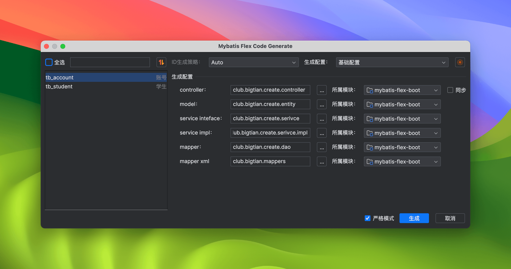
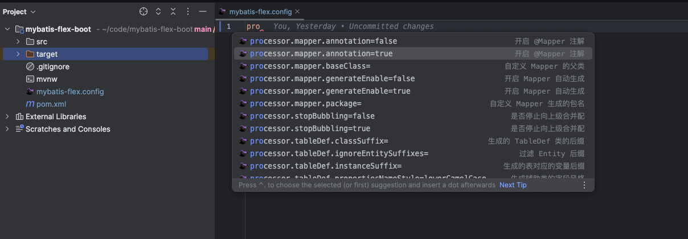
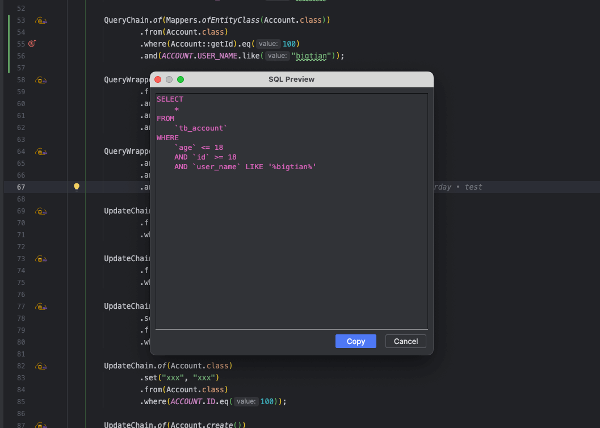
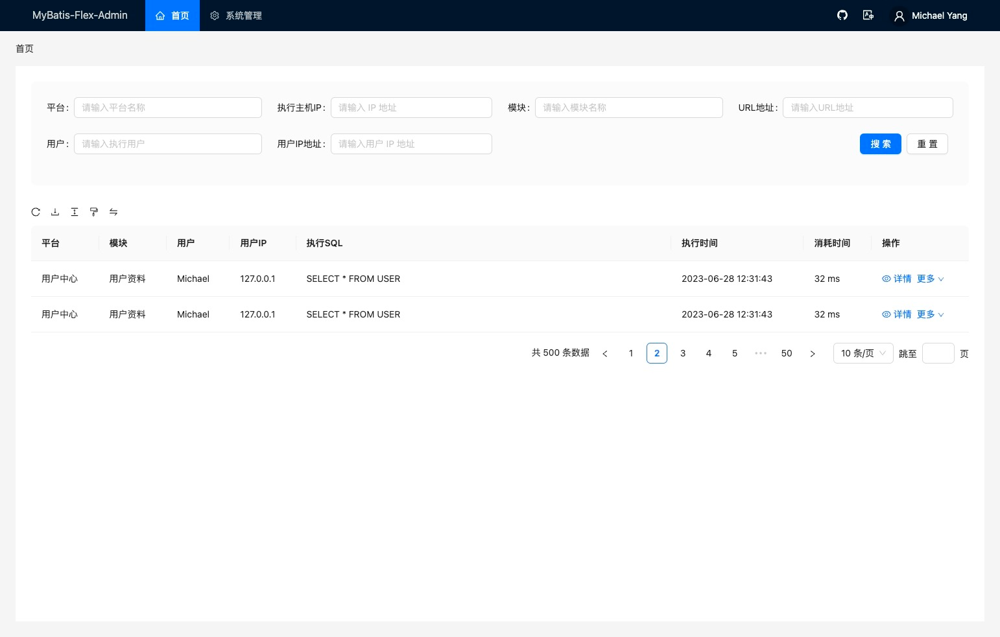

# MyBatis-Flex 周边

## 视频教程

**课程1：《MyBatis-Flex 视频教程》（免费、已完结、全网首发）**
> 课程简介：该课程由 [王帅](https://gitee.com/Suomm) 老师录制主讲， [王帅](https://gitee.com/Suomm) 老师也是除了作者以外，对 MyBatis-Flex 代码贡献最大的 committer。
> 其无论对 MyBatis 还是 MyBatis-Flex，都有非常深入的理解。

::: details 课程目录（点击展开）

- [MyBatis-Flex 视频教程 - 01 课程介绍](https://www.bilibili.com/video/BV11h411A7cU)
- [MyBatis-Flex 视频教程 - 02 MyBatis-Flex 简介](https://www.bilibili.com/video/BV1GW4y1f7vt)
- [MyBatis-Flex 视频教程 - 03 为什么使用 MyBatis-Flex](https://www.bilibili.com/video/BV1us4y167gk)
- [MyBatis-Flex 视频教程 - 04 基于 SpringBoot 的快速开始](https://www.bilibili.com/video/BV1yW4y1Z74j)
- [MyBatis-Flex 视频教程 - 05 自动生成类的介绍](https://www.bilibili.com/video/BV1XF411R7pQ)
- [MyBatis-Flex 视频教程 - 06 MyBatis-Flex 的配置选项](https://www.bilibili.com/video/BV1ys4y1676q)
- [MyBatis-Flex 视频教程 - 07 初识 BaseMapper 接口](https://www.bilibili.com/video/BV1Pm4y1E7PV)
- [MyBatis-Flex 视频教程 - 08 插入数据](https://www.bilibili.com/video/BV1Mz4y177jy)
- [MyBatis-Flex 视频教程 - 09 删除数据](https://www.bilibili.com/video/BV1gV4y1h7Jf)
- [MyBatis-Flex 视频教程 - 10 更新数据](https://www.bilibili.com/video/BV1Cg4y1w79y)
- [MyBatis-Flex 视频教程 - 11 复杂更新](https://www.bilibili.com/video/BV1wu411L7dF)
- [MyBatis-Flex 视频教程 - 12 基础查询](https://www.bilibili.com/video/BV1XN41117kx)
- [MyBatis-Flex 视频教程 - 13 映射查询](https://www.bilibili.com/video/BV1Cx4y1R7M8)
- [MyBatis-Flex 视频教程 - 14 QueryWrapper 的介绍](https://www.bilibili.com/video/BV1Mm4y177nq)
- [MyBatis-Flex 视频教程 - 15 QueryWrapper 的操作](https://www.bilibili.com/video/BV1R8411U7CT)
- [MyBatis-Flex 视频教程 - 16 @Table 注解的简单使用](https://www.bilibili.com/video/BV1Sk4y157ov)
- [MyBatis-Flex 视频教程 - 17 onInsert、onUpdate 的使用](https://www.bilibili.com/video/BV1rz4y1473L)
- [MyBatis-Flex 视频教程 - 18 onSet 实现字段权限](https://www.bilibili.com/video/BV1AN411e7id)
- [MyBatis-Flex 视频教程 - 19 onSet 实现字段加密](https://www.bilibili.com/video/BV12c411c74x)
- [MyBatis-Flex 视频教程 - 20 onSet 实现字典回写](https://www.bilibili.com/video/BV1uu41157bF)
- [MyBatis-Flex 视频教程 - 21 全局监听器配置](https://www.bilibili.com/video/BV1qm4y1L7Si)
- [MyBatis-Flex 视频教程 - 22 @Id 的简单使用](https://www.bilibili.com/video/BV1Hp4y1571K)
- [MyBatis-Flex 视频教程 - 23 自定义主键生成器](https://www.bilibili.com/video/BV1eM4y1p72z)
- [MyBatis-Flex 视频教程 - 24 @Column 注解的简单使用](https://www.bilibili.com/video/BV14c411w7Fr)
- [MyBatis-Flex 视频教程 - 25 isLogicDelete 逻辑删除的简单使用](https://www.bilibili.com/video/BV1K94y1e7X7)
- [MyBatis-Flex 视频教程 - 26 自定义逻辑删除处理器](https://www.bilibili.com/video/BV1oP411z7uu)
- [MyBatis-Flex 视频教程 - 27 version 乐观锁的简单使用](https://www.bilibili.com/video/BV1Rc411F7wp)
- [MyBatis-Flex 视频教程 - 28 tenantId 多租户的简单使用](https://www.bilibili.com/video/BV1eP41167TU)
- [MyBatis-Flex 视频教程 - 29 typeHandler 的简单使用](https://www.bilibili.com/video/BV1B841127ea)
- [MyBatis-Flex 视频教程 - 30 数据脱敏的简单使用](https://www.bilibili.com/video/BV1gz4y1s7Wg)
- [MyBatis-Flex 视频教程 - 31 枚举属性的使用](https://www.bilibili.com/video/BV1mm4y1W7SD)
- [MyBatis-Flex 视频教程 - 32 关联查询（Join Query）](https://www.bilibili.com/video/BV1B8411d7iC)
- [MyBatis-Flex 视频教程 - 33 关联查询（Field Query）](https://www.bilibili.com/video/BV17k4y1g7vt)
- [MyBatis-Flex 视频教程 - 34 关联查询（Relation Query）](https://www.bilibili.com/video/BV1bj411r7A4)
- [MyBatis-Flex 视频教程 - 35 关联查询对比](https://www.bilibili.com/video/BV1oF411f7dr)
- [MyBatis-Flex 视频教程 - 36 分页查询](https://www.bilibili.com/video/BV1d44y1F7JM)
- [MyBatis-Flex 视频教程 - 37 分页查询 count 查询优化](https://www.bilibili.com/video/BV1np4y1G7R9)
- [MyBatis-Flex 视频教程 - 38 基于 XML 文件的高性能分页](https://www.bilibili.com/video/BV1Zh4y1D7aj)
- [MyBatis-Flex 视频教程 - 39 Db + Row](https://www.bilibili.com/video/BV1wp4y1g7by)
- [MyBatis-Flex 视频教程 - 40 批量操作](https://www.bilibili.com/video/BV1PV4y1Y73a)
- [MyBatis-Flex 视频教程 - 41 IService 接口介绍](https://www.bilibili.com/video/BV14F411Z7EQ)
- [MyBatis-Flex 视频教程 - 42 数据权限的使用](https://www.bilibili.com/video/BV1Ju4y197xr)
- [MyBatis-Flex 视频教程 - 43 链式操作](https://www.bilibili.com/video/BV1Wu411J7Hu)
- [MyBatis-Flex 视频教程 - 44 多数据源的配置](https://www.bilibili.com/video/BV1f8411X7gW)
- [MyBatis-Flex 视频教程 - 45 多数据源的切换](https://www.bilibili.com/video/BV1544y1F7Wv)
- [MyBatis-Flex 视频教程 - 46 动态添加数据源](https://www.bilibili.com/video/BV1tm4y1H712)
- [MyBatis-Flex 视频教程 - 47 数据源加密](https://www.bilibili.com/video/BV1GF41117GC)
- [MyBatis-Flex 视频教程 - 48 事务的管理](https://www.bilibili.com/video/BV1oP411p7Wk)
- [MyBatis-Flex 视频教程 - 49 游标查询](https://www.bilibili.com/video/BV1JN4y1d7AB)
- [MyBatis-Flex 视频教程 - 50 数据缓存](https://www.bilibili.com/video/BV1cu4y1X7XL)
- [MyBatis-Flex 视频教程 - 51 数据缓存的简单使用](https://www.bilibili.com/video/BV1F8411X7EB)
- [MyBatis-Flex 视频教程 - 52 动态表名](https://www.bilibili.com/video/BV1D8411Q7tD)
- [MyBatis-Flex 视频教程 - 53 Active Record 模式](https://www.bilibili.com/video/BV1Lh4y1T7Ey)
- [MyBatis-Flex 视频教程 - 54 SQL 审计](https://www.bilibili.com/video/BV1kh4y127kz)
- [MyBatis-Flex 视频教程 - 55 SQL 打印](https://www.bilibili.com/video/BV1914y1C7Xk)
- [MyBatis-Flex 视频教程 - 56 MyBatis-Flex APT 配置](https://www.bilibili.com/video/BV1fh4y1T7o1)
- [MyBatis-Flex 视频教程 - 57 代码生成器（风格一）](https://www.bilibili.com/video/BV1o14y1C7pJ)
- [MyBatis-Flex 视频教程 - 58 代码生成器（风格二）](https://www.bilibili.com/video/BV14P411h7eM)
- [MyBatis-Flex 视频教程 - 59 自定义代码生成器](https://www.bilibili.com/video/BV1uu4y1v7Yg)
- [MyBatis-Flex 视频教程 - 60 课程总结](https://www.bilibili.com/video/BV1kN4y1R7Zx)
:::

课程地址：

https://www.bilibili.com/video/BV11h411A7cU

-----

**课程2：《MyBatis-Flex 轻松掌握，从零基础到高级应用的完整教程！持续更新中~》**

> 课程简介：该课程由周游老师录制，周游老师有多年的开发经验以及丰富的教学经验，能够把 MyBatis-Flex 的许多原理知识讲解的通俗易懂、深入浅出。

课程地址：

https://www.bilibili.com/video/BV1kF411r7ky

## 开源项目或作品

| 项目名称         | 描述                                                                                                                                        | 开源网址                                    |
|--------------|-------------------------------------------------------------------------------------------------------------------------------------------|-----------------------------------------|
| hh-vue       | 这是基于ruoyi-vue改造的项目，对flex完整封装可以参考此项项目                                                                                                      | https://gitee.com/min290/hh-vue         |
| youcan-solon | 基于 solon 框架做的一个类似 Ruoyi 的项目，使用flex自带的 mybatis-flex-solon-plugin 插件做集成，集成方式非常简单，属于即拿即用                                                           | https://gitee.com/gollyhu/youcan-solon  |
| Ruoyi-Flex   | Ruoyi-Flex是基于RuoYi-Vue v3.8.6进行的扩展，集成MyBatis-Flex、JDK17、lombok、Sa-Token、PowerJob、Hutool、OSS、ureport-keep、Flowable、vue3、TypeScript等优秀开源软件。 | https://gitee.com/dataprince/ruoyi-flex |
| 小鸣助手   |「小鸣助手」是一个生活服务类小程序，主要为用户的日常生活提供一些便捷工具，例如天气查询、时间规划、生活记录等。目前该小程序已稳定运行近4年，为近10万用户提供了生活帮助。主要技术栈：Spring Boot + Spring Security + JWT + MyBatis-Flex + MySQL + Redis + Docker | https://github.com/inlym/life-helper-server |
| RuoyiVueFlex  |RuoyiVueFlex是基于RuoyiVuePlus的一个快速开发框架。将RuoyiVuePlus中使用的MybatisPlus替换为MybatisFlex,并根据两个ORM框架使用的不同修改了部分逻辑。 集成 Sa-Token、Mybatis-Flex、PowerJob、Jackson、SpringDoc、Hutool、OSS 定期同步等 | https://gitee.com/yhan219/ruoyi-vue-flex |
| RuoyiCloudFlex  |RuoyiCloudFlex是基于RuoYiCloudPlus的微服务管理系统，将RuoyiCloudPlus中使用的MybatisPlus替换为MybatisFlex,并根据两个ORM框架使用的不同修改了部分逻辑。 整合 SpringCloudAlibaba、Dubbo3.0、Sa-Token、Mybatis-Flex、MQ、Flowable、ES、Docker 全方位升级 定期同步 | https://gitee.com/yhan219/ruoyi-cloud-flex |

## 开发插件

**Mybatis-Flex-Helper** 这是一款高度自定义的 Mybatis-Flex IDEA 插件（该工具由 Mybatis-Flex 社区的同学 [@时间淡忘一切](https://gitee.com/djxchi) 开发，
目前已经上架到应用商店，可以直接搜索安装）：

- 开源地址：https://gitee.com/djxchi/mybatis-flex-code-gen.git
- 视频简介：https://www.bilibili.com/video/BV1yV411g7Yd
- 插件交流 QQ 群：872707845

### 插件功能展示

**功能 1：完善的代码生成配置**

支持直接连接数据库，选择表后一键生成 Controller、Service、Mapper、Model 等代码，同时支持自定义代码文件和代码模板。

**功能 2：智能的 APT 配置文件自动提示功能**

直接编写 APT 配置文件，再也不担心写错，或者不明白其含义。

**功能 3：QueryWrapper SQL 预览**

我们在 Java 代码中，编写 QueryWrapper，可以直接预览 QueryWrapper 生成的 SQL，除了 QueryWrapper 以外，还支持 QueryChain、UpdateChain 等构建是的 SQL 预览功能。

## MyBatis-Flex-Admin

**MyBatis-Flex-Admin** 是一个基于 MyBatis-Flex 开发的 SQL 执行日志平台和 SQL 审计平台，整个项目只有 5 张表，也是一个绝佳的 MyBatis-Flex 学习项目。

该项目使用前后端分离的方式，后端使用 SpringBoot 2.x + MyBatis-Flex，前台有 React 和 Vue 两个版本，开源地址（当前正在开发中）：

https://gitee.com/mybatis-flex/mybatis-flex-admin

## MyBatis-Flex-Kotlin

MyBatis-Flex-Kotlin 基于 Mybatis-Flex 的 Kotlin 扩展模块，方便 Kotlin 开发者使用 MyBatis-Flex 进行开发，其主要由社区同学 [@kamo-sama](https://gitee.com/kamo-sama) 进行维护。

**特点**

- 本模块基于 [Mybatis-Flex](https://mybatis-flex.com) 核心库 ，只做扩展不做改变
- 结合 Kotlin 特性、DSL让数据库操作更简单

**开源地址：**

https://gitee.com/mybatis-flex/mybatis-flex-kotlin
