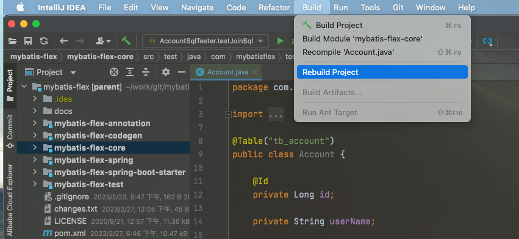

# 灵活的 QueryWrapper
在 [增删改](./add-delete-update) 和 [查询和分页](./query) 章节中，我们随时能看到 QueryWrapper 的身影，QueryWrapper 是用于构造 Sql 的
强有力工具，也是 MyBatis-Flex 的亮点和特色。

::: tip 提示
QueryWrapper 可以被序列化通过 RPC 进行传输，因此，在微服务项目中，我们可以在客户端（网关、Controller 层等）构造出 QueryWrapper，传给
Provider 层进行查询返回数据。
:::

## QueryWrapper 的使用

以下代码是一个完整 Spring Controller 的示例：

```java
@RestController
public class AccountController {

    @Autowired
    AccountMapper accountMapper;

    @GetMapping("/accounts")
    List<Account> selectList() {

        //构造 QueryWrapper，也支持使用 QueryWrapper.create() 构造，效果相同
        QueryWrapper query = new QueryWrapper();
        query.where(ACCOUNT.ID.ge(100));

        //通过 query 查询数据列表返回
        return accountMapper.selectListByQuery(query);
    }
}
```
在以上的示例中，其核心代码如下所示：

```java
//构造 QueryWrapper
QueryWrapper query = new QueryWrapper();
query.where(ACCOUNT.ID.ge(100));

//通过 query 查询数据列表
accountMapper.selectListByQuery(query);
```
以上代码执行的 Sql 如下：

```sql
select * from tb_account
where id >= 100
```

::: tip 问题：以上示例中，`ACCOUNT.ID.ge(100)` 中的 `ACCOUNT` 是怎么来的？
MyBatis-Flex 使用了 APT 技术，这个 `ACCOUNT` 是自动生成的。
参考：《[MyBatis-Flex APT 配置](../others/apt.md)》章节。
:::

## select *
```java
QueryWrapper query1 = new QueryWrapper();
query1.select(ACCOUNT.ID, ACCOUNT.USER_NAME)
    .from(ACCOUNT);

QueryWrapper query2 = new QueryWrapper();
query2.select().from(ACCOUNT);
```

其查询生成的 Sql 如下：

```sql
SELECT id, user_name FROM tb_account;

SELECT * FROM tb_account;
```

## select ... as

```java
QueryWrapper query = new QueryWrapper()
    .select(
          ACCOUNT.ID.as("accountId")
        , ACCOUNT.USER_NAME)
    .from(ACCOUNT.as("a"));
```

其查询生成的 Sql 如下：

```sql
SELECT a.id as accountId, a.user_name
FROM tb_account AS a
```

## select 多张表

```java
QueryWrapper query = new QueryWrapper()
    .select(
          ACCOUNT.ID
        , ACCOUNT.USER_NAME
        , ARTICLE.ID.as("articleId")
        , ARTICLE.TITLE)
    .from(ACCOUNT.as("a"), ARTICLE.as("b"))
    .where(ACCOUNT.ID.eq(ARTICLE.ACCOUNT_ID));
```

其查询生成的 Sql 如下：

```sql
SELECT a.id, a.user_name, b.id AS articleId, b.title
FROM tb_account AS a,
     tb_article AS b
WHERE a.id = b.account_id
```

## select function（SQL 函数）

所有函数均在 `QueryMethods` 类中，以下示例皆为静态导入方法，省略了类名。

示例 ：

```java
QueryWrapper query = new QueryWrapper()
        .select(
            ACCOUNT.ID,
            ACCOUNT.USER_NAME,
            max(ACCOUNT.BIRTHDAY),
            avg(ACCOUNT.SEX).as("sex_avg")
        ).from(ACCOUNT);
```

其查询生成的 Sql 如下：

```sql
SELECT id, user_name, MAX(birthday), AVG(sex) AS sex_avg
FROM tb_account
```

在使用函数时，一些数字、字符串常量需要通过特定的方法去构造，例如：

- number()：构建数字常量
- string()：构建字符串常量
- column()：构建自定义列

示例：

```txt
select(number(1)) --> SELECT 1
select(string("str")) --> SELECT 'str'
select(column("abc")) --> SELECT abc
```

目前，MyBatis-Flex 已支持 110+ 个常见的 SQL
函数，查看已支持的 [所有函数](https://gitee.com/mybatis-flex/mybatis-flex/blob/main/mybatis-flex-core/src/main/java/com/mybatisflex/core/constant/FuncName.java)。
若还不满足，您可以参考 [QueryMethods](https://gitee.com/mybatis-flex/mybatis-flex/blob/main/mybatis-flex-core/src/main/java/com/mybatisflex/core/query/QueryMethods.java)
，然后在自己的项目里进行自定义扩展。


| 支持的函数 | 函数说明  |
| -------- | -------- |
| count | 查询数据总量  |
| distinct | 对指定列进行去重  |
| sum | 返回指定字段值的和  |
| avg | 返回指定列的平均值  |
| min | 返回指定列的最小值  |
| max | 返回指定列的最大值  |
| abs | 返回绝对值 |
| ceil | 返回大于或等于 x 的最小整数（向上取整） |
| ceiling | 返回大于或等于 x 的最小整数（向上取整） |
| floor |  返回小于或等于 x 的最大整数（向下取整） |
| rand |  返回 0~1 的随机数 |
| sign |  返回 x 的符号，x 是负数、0、正数分别返回 -1、0、1 |
| pi |  返回圆周率 |
| truncate |  返回数值 x 保留到小数点后 y 位的值 |
| round |  返回离 x 最近的整数（四舍五入） |
| pow |  返回 x 的 y 次方 |
| power |  返回 x 的 y 次方 |
| sqrt |  返回 x 的平方根 |
| exp |  返回 e 的 x 次方 |
| mod |  返回 x 除以 y 以后的余数 |
| log |   返回自然对数（以 e 为底的对数） |
| log10 |   返回以 10 为底的对数 |
| radians |   将角度转换为弧度 |
| degrees |   将弧度转换为角度 |
| sin |   求正弦值 |
| asin |   求反正弦值 |
| cos |   求余弦值 |
| acos |   求反余弦值 |
| tan |   求正切值 |
| atan |   求反正切值 |
| cot |   求余切值 |
| charLength |   返回字符串 s 的字符数 |
| length |   返回字符串 s 的长度 |
| concat |   将字符串 s1，s2 等多个字符串合并为一个字符串 |
| concatWs |   同 CONCAT(s1, s2, ...)，但是每个字符串之间要加上 x |
| insert |  将字符串 s2 替换 s1 的 x 位置开始长度为 len 的字符串 |
| upper |  将字符串 s 的所有字符都变成大写字母 |
| lower |  将字符串 s 的所有字符都变成小写字母 |
| left |  返回字符串 s 的前 n 个字符 |
| right |  返回字符串 s 的后 n 个字符 |
| lpad |  字符串 s2 来填充 s1 的开始处，使字符串长度达到 len |
| rpad |  字符串 s2 来填充 s1 的结尾处，使字符串长度达到 len |
| trim |  去掉字符串 s 开始处和结尾处的空格 |
| ltrim |  去掉字符串 s 开始处的空格 |
| rtrim |   去掉字符串 s 结尾处的空格 |
| repeat |   将字符串 s 重复 n 次 |
| space |   返回 n 个空格 |
| replace |   用字符串 s2 代替字符串 s 中的字符串 s1 |
| strcmp |   比较字符串 s1 和 s2 |
| substring |   获取从字符串 s 中的第 n 个位置开始长度为 len 的字符串 |
| instr |   从字符串 s 中获取 s1 的开始位置 |
| reverse |  将字符串 s 的顺序反过来 |
| elt |  返回第 n 个字符串 |
| field |  返回第一个与字符串 s 匹配的字符串的位置 |
| findInSet |  返回在字符串 s2 中与 s1 匹配的字符串的位置 |
| curDate |  返回当前日期 |
| currentDate |  返回当前日期 |
| curTime |  返回当前时间 |
| currentTime |  返回当前时间 |
| now |  返回当前日期和时间 |
| currentTimestamp |  返回当前日期和时间 |
| localTime |  返回当前日期和时间 |
| sysDate |  返回当前日期和时间 |
| localTimestamp |  返回当前日期和时间 |
| unixTimestamp |  以 UNIX 时间戳的形式返回当前时间 |
| fromUnixTime |   把 UNIX 时间戳的时间转换为普通格式的时间 |
| utcDate |   返回 UTC（国际协调时间）日期 |
| utcTime |   返回 UTC 时间 |
| month |    返回日期 d 中的月份值，范围是 1~12 |
| monthName |    返回日期 d 中的月份名称，如 january |
| dayName |    返回日期 d 是星期几，如 Monday |
| dayOfWeek |    返回日期 d 是星期几，1 表示星期日，2 表示星期二 |
| weekday |    返回日期 d 是星期几，0 表示星期一，1 表示星期二 |
| week |  计算日期 d 是本年的第几个星期，范围是 0-53 |
| weekOfYear |  计算日期 d 是本年的第几个星期，范围是 1-53 |
| dayOfYear |  计算日期 d 是本年的第几天 |
| dayOfMonth |  计算日期 d 是本月的第几天 |
| year |  返回日期 d 中的年份值 |
| day |  返回日期 d 中的天数值 |
| quarter |  返回日期 d 是第几季度，范围 1-4 |
| hour |  返回时间 t 中的小时值 |
| minute |  返回时间 t 中的分钟值 |
| second |  返回时间 t 中的秒钟值 |
| timeToSec |  将时间 t 转换为秒 |
| secToTime |  将以秒为单位的时间 s 转换为时分秒的格式 |
| toDays |  计算日期 d 到 0000 年 1 月 1 日的天数 |
| fromDays |  计算从 0000 年 1 月 1 日开始 n 天后的日期 |
| dateDiff |  计算日期 d1 到 d2 之间相隔的天数 |
| addDate |  计算开始日期 d 加上 n 天的日期 |
| subDate |  计算起始日期 d 减去 n 天的日期 |
| addTime |  计算起始时间 t 加上 n 秒的时间 |
| subTime |  计算起始时间 t 加上 n 秒的时间 |
| dateFormat |  按照表达式 f 的要求显示日期 d |
| timeFormat |  按照表达式 f 的要求显示时间 t |
| getFormat |  根据字符串 s 获取 type 类型数据的显示格式 |
| version |  返回数据库的版本号 |
| connectionId |  返回服务器的连接数 |
| database |  返回当前数据库名 |
| schema |  返回当前数据库 schema |
| user |  返回当前用户的名称 |
| charset |  返回字符串 str 的字符集 |
| collation |  返回字符串 str 的字符排列方式 |
| lastInsertId |  返回最后生成的 auto_increment 值 |
| password |  对字符串 str 进行加密 |
| md5 |  对字符串 str 进行 md5 加密 |
| encode |  使用字符串 pswd_str 来加密字符串 str，加密结果是一个二进制数，必须使用 BLOB 类型来保持它 |
| decode |   解密函数，使用字符串 pswd_str 来为 crypt_str 解密 |
| format |   格式化函数，可以将数字 x 进行格式化，将 x 保留到小数点后 n 位，这个过程需要进行四舍五入 |
| ascii |   返回字符串 s 的第一个字符的 ASSCII 码 |
| bin |   返回 x 的二进制编码 |
| hex |   返回 x 的十六进制编码 |
| oct |   返回 x 的八进制编 |
| conv |    将 x 从 f1 进制数变成 f2 进制数 |
| inetAton |   将 IP 地址转换为数字表示，IP 值需要加上引号 |
| inetNtoa |   将数字 n 转换成 IP 的形式 |


## select 列计算

#### 示例 1：

```java
QueryWrapper query = new QueryWrapper()
    .select(ACCOUNT.ID.add(100).as("x100"))
    .from(ACCOUNT);

String sql = query.toSQL();
```
> 列计算的 **加减乘除** 对应的方法分别为：add / subtract / multiply / divide

其查询生成的 Sql 如下：

```sql
SELECT (`id` + 100) AS `x100` FROM `tb_account`
```


#### 示例 2：

```java
QueryWrapper query = new QueryWrapper()
    .select(sum(ACCOUNT.ID.multiply(ACCOUNT.AGE)).as("total_x"))
    .from(ACCOUNT);
```

其查询生成的 Sql 如下：

```sql
SELECT SUM(`id` * `age`) AS `total_x` FROM `tb_account`
```


#### 示例 3：

```java
QueryWrapper query = new QueryWrapper()
    .select(ACCOUNT.ID.add(ACCOUNT.AGE.add(100)).as("x100"))
    .from(ACCOUNT);

String sql = query.toSQL();
```

其查询生成的 Sql 如下：

```sql
SELECT (`id` + (`age` + 100)) AS `x100` FROM `tb_account`
```


## select 取相反数

```java
import static com.mybatisflex.core.query.QueryMethods.*;

QueryWrapper queryWrapper = QueryWrapper.create()
    // 负数常量需要手动加括号，不能写成 number(-1)
    .select(negative(column("(-1)")))
    .select(negative(abs(ACCOUNT.AGE)).as("opp"))
    .select(negative(ACCOUNT.ID.add(ACCOUNT.AGE)))
    .from(ACCOUNT);
```

```sql
SELECT -(-1), -ABS(`age`) AS `opp`, -(`id` + `age`) FROM `tb_account`
```

## select case...when

**示例 1：**

```java
QueryWrapper wrapper = QueryWrapper.create()
        .select(
             ACCOUNT.ID
            ,case_()
                .when(ACCOUNT.ID.ge(2)).then("x2")
                .when(ACCOUNT.ID.ge(1)).then("x1")
                .else_("x100")
                .end().as("xName")
        )
```

其查询生成的 Sql 如下：

```sql
 SELECT `id`,
        (CASE WHEN `id` >=  2  THEN 'x2'
            WHEN `id` >=  1  THEN 'x1'
            ELSE 'x100'
            END) AS `xName`
 FROM `tb_account`
```

SQL 执行的结果如下：

```
|id     |xName     |
|1      |x1        |
|2      |x2        |
```


**示例 2：**

```java
QueryWrapper queryWrapper = QueryWrapper.create()
        .select(
                ACCOUNT.ALL_COLUMNS,
                case_(ACCOUNT.ID)
                    .when(100).then(100)
                    .when(200).then(200)
                    .else_(300).end().as("result")
        )
        .from(ACCOUNT)
        .where(ACCOUNT.USER_NAME.like("michael"));
```

其查询生成的 Sql 如下：

```sql
SELECT *,
       (CASE `id`
           WHEN 100 THEN 100
           WHEN 200 THEN 200
           ELSE 300 END) AS `result`
FROM `tb_account`
WHERE `user_name` LIKE  ?
```

::: tip 提示
在以上示例中，由于 `case` 和 `else` 属于 Java 关键字，无法使用其进行方法命名，因此会添加一个下划线小尾巴 `"_"` 变成 `case_` 和 `else_`，这是无奈之举。
在以后的 QueryWrapper 构建中，遇到 java 关键字也会采用类似的解决方法。
:::


## with...select

示例 1：

```java
QueryWrapper query = new QueryWrapper()
        .with("CTE").asSelect(
                select().from(ARTICLE).where(ARTICLE.ID.ge(100))
        )
        .select()
        .from(ACCOUNT)
        .where(ACCOUNT.SEX.eq(1));

System.out.println(query.toSQL());
```

生成的 SQL 如下：

```sql
WITH CTE AS (SELECT * FROM `tb_article` WHERE `id` >= 100)
SELECT * FROM `tb_account` WHERE `sex` = 1
```


示例 2：

```java
QueryWrapper query = new QueryWrapper()
    .with("xxx", "id", "name").asValues(
        Arrays.asList("a", "b"),
        union(
            select().from(ARTICLE).where(ARTICLE.ID.ge(200))
        )
    )
    .from(ACCOUNT)
    .where(ACCOUNT.SEX.eq(1));

System.out.println(query.toSQL());
```

生成的 SQL 如下：

```sql
WITH xxx(id, name)
    AS (VALUES (a, b) UNION (SELECT * FROM `tb_article` WHERE `id` >= 200))
SELECT * FROM `tb_account` WHERE `sex` = 1
```


## with recursive...select

示例 1：

```java
QueryWrapper query = new QueryWrapper()
    .withRecursive("CTE").asSelect(
        select().from(ARTICLE).where(ARTICLE.ID.ge(100))
    )
    .from(ACCOUNT)
    .where(ACCOUNT.SEX.eq(1));

System.out.println(query.toSQL());
```

生成的 SQL 如下：

```sql
WITH RECURSIVE CTE AS (SELECT * FROM `tb_article` WHERE `id` >= 100)
SELECT * FROM `tb_account` WHERE `sex` = 1
```


示例 2：

```java
QueryWrapper query = new QueryWrapper()
    .withRecursive("CTE").asSelect(
        select().from(ARTICLE).where(ARTICLE.ID.ge(100))
    )
    .with("xxx", "id", "name").asValues(
        Arrays.asList("a", "b"),
        union(
            select().from(ARTICLE).where(ARTICLE.ID.ge(200))
        )
    )
    .from(ACCOUNT)
    .where(ACCOUNT.SEX.eq(1));

System.out.println(query.toSQL());
```

生成的 SQL 如下：

```sql
WITH RECURSIVE
     CTE AS (SELECT * FROM `tb_article` WHERE `id` >= 100),
     xxx(id, name) AS (VALUES (a, b)  UNION (SELECT * FROM `tb_article` WHERE `id` >= 200))
SELECT * FROM `tb_account` WHERE `sex` = 1
```


## where

```java
QueryWrapper queryWrapper=QueryWrapper.create()
    .select()
    .from(ACCOUNT)
    .where(ACCOUNT.ID.ge(100))
    .and(ACCOUNT.USER_NAME.like("michael"));
```

其查询生成的 Sql 如下：

```sql
SELECT * FROM tb_account
WHERE id >=  ?
AND user_name LIKE  ?
```

## where 动态条件
::: tip 注意
QueryWrapper条件构建中，若参数为null时默认会被忽略，不会拼接查询条件
:::

**方式1：when()**

```java 1,4
boolean flag = false;
QueryWrapper queryWrapper = QueryWrapper.create()
    .select().from(ACCOUNT)
    .where(ACCOUNT.ID.ge(100).when(flag)) //flag为false，忽略该条件
    .and(ACCOUNT.USER_NAME.like("michael"));
```

其查询生成的 Sql 如下：

```sql
SELECT * FROM tb_account
WHERE user_name LIKE 'michael'
```
**方式2：使用重载方法**
```java 1,4
boolean flag = false;
QueryWrapper queryWrapper = QueryWrapper.create()
    .select().from(ACCOUNT)
    .and(ACCOUNT.USER_NAME.like("michael", flag)); //flag为false，忽略该条件
```
对当前条件参数进行判断：
```java 1,5
String name = "";
QueryWrapper queryWrapper = QueryWrapper.create()
    .select().from(ACCOUNT)
    .where(ACCOUNT.USER_NAME.like(name, StringUtil::isNotBlank)); //name为空字符串，忽略该条件
```
框架提供了工具类`If`，包含常用的判断方法（如非空、非空集合、非空字符串等），供开发者简化代码：
```java 1,5
String name = "";
QueryWrapper queryWrapper = QueryWrapper.create()
    .select().from(ACCOUNT)
    .where(ACCOUNT.USER_NAME.like(name, If::hasText)); //name是否有文本
```

上述代码生成的 Sql 如下：

```sql
SELECT * FROM tb_account;
```

## where 使用 SQL 函数
你可以通过使用 QueryMethods 类下的函数实现 where 对指定列运算后作为条件进行查询（QueryMethods 位于 mybatisflex.core.query 下）。

```java 1,5
QueryWrapper qw = QueryWrapper.create();
qw.select(USER.ID,
    USER.USER_ALIAS,
    USER.PASSWORD,
    USER.USER_NAME.as("userName"))
    .where(
           QueryMethods.abs(USER.ID).eq(1)
    )
    .from(USER);
```

其查询生成的 Sql 如下：


```sql
SELECT `id`, `alias`, `pwd`, `name` AS `userName`
FROM `user` WHERE ABS(`id`) = 1
```


## where select
```java
QueryWrapper queryWrapper = QueryWrapper.create()
    .select()
    .from(ACCOUNT)
    .where(ACCOUNT.ID.ge(
        select(ARTICLE.ACCOUNT_ID).from(ARTICLE).where(ARTICLE.ID.ge(100))
    ));
```

其查询生成的 Sql 如下：

```sql
SELECT * FROM tb_account
WHERE id >=
(SELECT account_id FROM tb_article WHERE id >=  ? )
```

## where exists, not exists
```java
QueryWrapper queryWrapper=QueryWrapper.create()
    .select()
    .from(ACCOUNT)
    .where(ACCOUNT.ID.ge(100))
    .and(
        exists(  // or notExists(...)
            selectOne().from(ARTICLE).where(ARTICLE.ID.ge(100))
        )
    );
```

其查询生成的 Sql 如下：

```sql
SELECT * FROM tb_account
WHERE id >=  ?
AND EXISTS (
    SELECT 1 FROM tb_article WHERE id >=  ?
)
```

## and (...) or (...)

```java
QueryWrapper queryWrapper=QueryWrapper.create()
    .select()
    .from(ACCOUNT)
    .where(ACCOUNT.ID.ge(100))
    .and(ACCOUNT.SEX.eq(1).or(ACCOUNT.SEX.eq(2)))
    .or(ACCOUNT.AGE.in(18,19,20).and(ACCOUNT.USER_NAME.like("michael")));
```

其查询生成的 Sql 如下：

```sql
SELECT * FROM tb_account
WHERE id >=  ?
AND (sex =  ? OR sex =  ? )
OR (age IN (?,?,?) AND user_name LIKE ? )
```


## 自定义字符串列名


```java
// 静态导入 QueryMethods.column 方法
QueryColumn a1 = column("a1");

QueryWrapper queryWrapper = QueryWrapper.create()
    .select()
    .from(ACCOUNT)
    .where(a1.ge(100))
    .and(a1.ne(200))
```

其查询生成的 Sql 如下：

```sql
SELECT * FROM tb_account
WHERE a1 >=  100
AND a1 != 200
```

以上 SQL 的 Java 代码也可以简写为：

```java
QueryWrapper queryWrapper = QueryWrapper.create()
    .from(ACCOUNT)
    .where(column("a1").ge(100))
    .and(column("a1").ne(200))
```

注意，以上代码需要静态导入 QueryMethods.column 方法：

```java
import static com.mybatisflex.core.query.QueryMethods.*;
```

## group by

```java
QueryWrapper queryWrapper=QueryWrapper.create()
    .select()
    .from(ACCOUNT)
    .groupBy(ACCOUNT.USER_NAME);
```


其查询生成的 Sql 如下：

```sql
SELECT * FROM tb_account
GROUP BY user_name
```

## having

```java
QueryWrapper queryWrapper=QueryWrapper.create()
    .select()
    .from(ACCOUNT)
    .groupBy(ACCOUNT.USER_NAME)
    .having(ACCOUNT.AGE.between(18,25));
```

其查询生成的 Sql 如下：

```sql
SELECT * FROM tb_account
GROUP BY user_name
HAVING age BETWEEN  ? AND ?
```

## orderBy

```java
QueryWrapper queryWrapper=QueryWrapper.create()
    .select()
    .from(ACCOUNT)
    .orderBy(ACCOUNT.AGE.asc(), ACCOUNT.USER_NAME.desc().nullsLast());
```

其查询生成的 Sql 如下：

```sql
SELECT * FROM tb_account
ORDER BY age ASC, user_name DESC NULLS LAST
```

## orderBy 动态排序

```java
QueryWrapper queryWrapper = QueryWrapper.create()
    .select()
    .from(ACCOUNT)
    // 动态条件取值：true 升序 false 降序 null 不排序。
    .orderBy(ACCOUNT.ID, true)
    .orderBy(ACCOUNT.BIRTHDAY, false)
    .orderBy(ACCOUNT.USER_NAME, null);
```

其查询生成的 Sql 如下：

```sql
SELECT *
FROM `tb_account`
ORDER BY `id` ASC, `birthday` DESC
```

## hint

Hint 是数据库厂商（比如 Oracle、MySQL、达梦等）提供的一种 SQL语法，它允许用户在 SQL 语句中插入相关的语法，从而影响 SQL 的执行方式。
它是一种【非常规】的直接影响优化器、指定执行计划的 SQL 优化手段。


```java
QueryWrapper queryWrapper=QueryWrapper.create()
    .select().hint("INDEX_DESC")
    .from(ACCOUNT)
    .orderBy(ACCOUNT.AGE.asc(), ACCOUNT.USER_NAME.desc().nullsLast());
```

其查询生成的 Sql 如下：

```sql
SELECT /*+ INDEX_DESC */  * FROM tb_account
ORDER BY age ASC, user_name DESC NULLS LAST
```


## join（left join，inner join...）

```java
QueryWrapper queryWrapper=QueryWrapper.create()
    .select()
    .from(ACCOUNT)
    .leftJoin(ARTICLE).on(ACCOUNT.ID.eq(ARTICLE.ACCOUNT_ID))
    .innerJoin(ARTICLE).on(ACCOUNT.ID.eq(ARTICLE.ACCOUNT_ID))
    .where(ACCOUNT.AGE.ge(10));
```


其查询生成的 Sql 如下：

```sql
SELECT * FROM tb_account
LEFT JOIN tb_article ON tb_account.id = tb_article.account_id
INNER JOIN tb_article ON tb_account.id = tb_article.account_id
WHERE tb_account.age >=  ?
```

## join on 多个条件

```java
QueryWrapper queryWrapper = QueryWrapper.create()
    .select()
    .from(ACCOUNT)
    .leftJoin(ARTICLE).on(
        ACCOUNT.ID.eq(ARTICLE.ACCOUNT_ID).and(ACCOUNT.AGE.eq(18))
    )
    .where(ACCOUNT.AGE.ge(10));
```

其查询生成的 Sql 如下：

```sql
SELECT * FROM tb_account LEFT JOIN tb_article
ON tb_account.id = tb_article.account_id AND tb_account.age =  ?
WHERE tb_account.age >=  ?
```

## join select

```java
QueryWrapper queryWrapper = QueryWrapper.create()
    .select()
    .from(ACCOUNT)
    .leftJoin(
        select().from(ARTICLE).where(ARTICLE.ID.ge(100))
    ).as("a").on(
        ACCOUNT.ID.eq(raw("a.id"))
    )
    .where(ACCOUNT.AGE.ge(10));

```

其查询生成的 Sql 如下：

```sql
SELECT * FROM tb_account
LEFT JOIN (SELECT * FROM tb_article WHERE id >=  ? ) AS a
ON tb_account.id = a.id
WHERE tb_account.age >=  ?
```

## join 自己

```java
AccountTableDef a1 = ACCOUNT.as("a1");
AccountTableDef a2 = ACCOUNT.as("a2");
ArticleTableDef ar = ARTICLE.as("ar");

QueryWrapper queryWrapper = new QueryWrapper()
    .select(ar.CONTENT, a1.ID, a2.AGE)
    .from(ar)
    .leftJoin(a1).on(a1.ID.eq(ar.ACCOUNT_ID))
    .leftJoin(a2).on(a2.ID.eq(ar.ACCOUNT_ID));
```

其查询生成的 Sql 如下：

```sql
SELECT
    ` ar `.` content `,
    ` a1 `.` id `,
    ` a2 `.` age `
FROM
    ` tb_article ` AS ` ar `
    LEFT JOIN ` tb_account ` AS ` a1 ` ON ` a1 `.` id ` = ` ar `.` account_id `
    LEFT JOIN ` tb_account ` AS ` a2 ` ON ` a2 `.` id ` = ` ar `.` account_id `
```

若 `tb_account` 表带有逻辑删除，那么其生成的 SQL 如下：

```sql
SELECT
    ` ar `.` content `,
    ` a1 `.` id `,
    ` a2 `.` age `
FROM
    ` tb_article ` AS ` ar `
    LEFT JOIN ` tb_account ` AS ` a1 ` ON (` a1 `.` id ` = ` ar `.` account_id `)
    AND ` a1 `.` is_delete ` = 0
    LEFT JOIN ` tb_account ` AS ` a2 ` ON (` a2 `.` id ` = ` ar `.` account_id `)
    AND ` a2 `.` is_delete ` = 0
```

> 关于逻辑删除更多文档请参考 [这里](../core/logic-delete.html)。

## union, union all

```java
QueryWrapper query = new QueryWrapper()
    .select(ACCOUNT.ID)
    .from(ACCOUNT)
    .orderBy(ACCOUNT.ID.desc())
    .union(select(ARTICLE.ID).from(ARTICLE))
    .unionAll(select(ARTICLE.ID).from(ARTICLE));
```

其查询生成的 Sql 如下：

```sql
(SELECT id FROM tb_account ORDER BY id DESC)
UNION (SELECT id FROM tb_article)
UNION ALL (SELECT id FROM tb_article)
```


## limit... offset

::: tip 提示
在 "limit... offset" 的示例中，MyBatis-Flex 能够自动识别当前数据库👍，并根据数据库的类型生成不同的 SQL，用户也可以很轻易的通过 DialectFactory 注册（新增或改写）自己的实现方言。
:::


```java
QueryWrapper queryWrapper = QueryWrapper.create()
    .select()
    .from(ACCOUNT)
    .orderBy(ACCOUNT.ID.desc())
    .limit(10)
    .offset(20);
```

MySQL 下执行的代码如下：
```sql
SELECT * FROM `tb_account` ORDER BY `id` DESC LIMIT 20, 10
```

PostgreSQL 下执行的代码如下：
```sql
SELECT * FROM "tb_account" ORDER BY "id" DESC LIMIT 20 OFFSET 10
```
Informix 下执行的代码如下：
```sql
SELECT SKIP 20 FIRST 10 * FROM "tb_account" ORDER BY "id" DESC
```

Oracle 下执行的代码如下：
```sql
SELECT * FROM (SELECT TEMP_DATAS.*,
    ROWNUM RN FROM (
        SELECT * FROM "tb_account" ORDER BY "id" DESC)
    TEMP_DATAS WHERE  ROWNUM <=30)
WHERE RN >20
```

Db2 下执行的代码如下：
```sql
SELECT * FROM "tb_account" ORDER BY "id" DESC
OFFSET 20 ROWS FETCH NEXT 10 ROWS ONLY
```

Sybase 下执行的代码如下：
```sql
SELECT TOP 10 START AT 21 * FROM "tb_account" ORDER BY "id" DESC
```

Firebird 下执行的代码如下：
```sql
SELECT * FROM "tb_account" ORDER BY "id" DESC ROWS 20 TO 30
```

## Lambda 扩展

简单示例：
```java
QueryWrapper query = QueryWrapper.create();
query.where(Account::getId).ge(100)
        .and(Account::getUserName).like("michael")
        .or(Account::getUserName).like(" ", If::hasText);
System.out.println(query.toSQL());
```
SQL 输入内容如下：

```sql
SELECT * FROM  WHERE `id` >=  100  AND `user_name` LIKE  '%michael%'
```

稍微复杂点的示例：

```java
QueryWrapper query = QueryWrapper.create()
    .from(Article.class)
    .leftJoin(Account.class).as("a").on(
        //无其他特殊条件可简化成：.on(Account::getId, Article::getAccountId)
        wrapper -> wrapper.where(Account::getId).eq(Article::getAccountId)
    )
    .where(Account::getId).ge(100, If::notEmpty)
    .and(wrapper -> {
        wrapper.where(Account::getId).ge(100)
                .or(Account::getAge).gt(200)
                .and(Article::getAccountId).eq(200)
                .or(wrapper1 -> {
                    wrapper1.where(Account::getId).like("a");
                })
        ;
    });
System.out.println(query.toSQL());
```
SQL 输入内容如下：

```sql
SELECT * FROM `tb_article`
    LEFT JOIN `tb_account` AS `a` ON `a`.`id` = `tb_article`.`account_id`
WHERE `a`.`id` >=  100  AND
      (`a`.`id` >=  100
           OR `a`.`age` >  200
           AND `tb_article`.`account_id` =  200
           OR (`a`.`id` LIKE  '%a%' )
      )
```

## MyBatis-Plus 兼容 API <Badge type="tip" text="^ v1.7.2" />

从 MyBatis-Flex v1.7.2 开始，QueryWrapper 添加了一系列对 MyBatis-Plus 兼容的 API，方便喜欢 MyBatis-Flex 用户从 MyBatis-Plus 迁移到 MyBatis-Flex。

示例代码如下：

```java
QueryWrapper queryWrapper = new QueryWrapper();
queryWrapper.from("tb_account")
    .eq("column1", "value1")
    .ge(Account::getAge, 18)
    .or(wrapper -> {
        wrapper.eq("column2", "value2")
            .ge(Account::getSex, 0);
    });

System.out.println(queryWrapper.toSQL());
```

以上代码内容，输出的 SQL 如下：

```sql
SELECT * FROM `tb_account`
WHERE column1 = 'value1' AND `age` >= 18
OR (column2 = 'value2' AND `sex` >= 0)
```

以上的 API 虽然尽量兼容 MyBatis-Plus，但也有所不同，需要用户注意以下几点：

**注意点 1：**

> 对于 `eq()`、`ne()`、`...` 等方法的忽略条件判断，MyBatis-Plus 在第一个参数，而 MyBatis-Flex 在 **最后一个** 参数。例如：

MyBatis-Plus 的写法：

```java
QueryWrapper qw = new QueryWrapper();
qw.eq(false, "column1", 0); // MyBatis-Plus 在第一个参数
```

MyBatis-Flex 的写法：

```java
QueryWrapper qw = new QueryWrapper();
qw.eq("column1", 0, false); // MyBatis-Flex 在最后一个参数
```

**注意点 2：**

> 对于 `likeLeft`、`likeRight`、 `notLikeLeft`、`notLikeRight` 这 4 个方法，MyBatis-Flex 和 MyBatis-Plus 是相反的。

例如：

```java
QueryWrapper qw = new QueryWrapper();
qw.likeLeft("name", "3");
```
MyBatis-Plus 生成的 where 条件是：

```sql
where name like '%3'
```

而 MyBatis-Flex 生成的 where 条件是：

```sql
where name like '3%'
```

因此，假设数据表的内容如下：

```shell
name
————
123
345
```
相同的代码 `qw.likeLeft("name", "3")`，MyBatis-Flex 匹配到的内容是 `345`，而 MyBatis-Plus 匹配到的内容是 `123`。


## Entity 转化为 QueryWrapper

QueryWrapper 提供了 `create()` 方法帮助用户把 entity 转化为 QueryWrapper。

简单示例：

```java
Account account = new Account();
account.setAge(18);
account.setUserName("michael");

QueryWrapper qw = QueryWrapper.create(account);
System.out.println(qw.toSQL());
```

输出的 SQL 内容如下：

```sql
SELECT `id`, `user_name`, `birthday`, `sex`, `age`, `is_normal`
FROM `tb_account`
WHERE `user_name` = 'michael' and `age` = 18
```

自定义 Entity 字段的 SQL 操作符示例：

```java
Account account = new Account();
account.setAge(18);
account.setUserName("michael");

SqlOperators operators = SqlOperators.of()
  .set(Account::getUserName, SqlOperator.LIKE)
  .set(Account::getAge, SqlOperator.GE);

QueryWrapper qw = QueryWrapper.create(account, operators);
System.out.println(qw.toSQL());
```

输出的 SQL 内容如下：

```sql
SELECT `id`, `user_name`, `birthday`, `sex`, `age`, `is_normal`
FROM `tb_account`
WHERE `user_name` LIKE '%michael%' AND `age` >= 18
```

## Map 转化为 QueryWrapper

方法同 [Entity 转化为 QueryWrapper](#entity-转化为-querywrapper) 类似，只需要把 entity 变量替换为 map 即可。

## QueryWrapper 序列化

在 `QueryWrapper` 中，由于其定义了 `循环引用` 的一些数据结构，同时，其很多属性都是 `private` 或者 `protected` 修饰且没有 `getter` `setter` 方法，
这会导致使用一些 json 库在序列化的过程中，出现问题；但这些问题并非 `QueryWrapper` 的问题，而是序列化框架的问题。

因此，我们在使用序列化框架时，需要注意其是否支持这些特征，比如在使用 FastJson2 序列化时，需要添加以下配置：

序列化：

```java
String json = JSON.toJSONString(queryWrapper
        , JSONWriter.Feature.FieldBased // 基于 field，而非 getter 方法
        , JSONWriter.Feature.ReferenceDetection);
```

反序列化：

```java
QueryWrapper query  = JSON.parseObject(json, QueryWrapper.class
, JSONReader.Feature.FieldBased);
```

`Gson` 、`Jackson` 等其他框架需要自行参考其文档添加相关配置；另外，我们更加建议使用专业的序列化工具去进行序列化，而非使用 json，比如使用 `JDK Serial` 或者 `fst` 等。
以下是相关的序列化示例代码：

`JDK Serial` 序列化：

```java
QueryWrapper queryWrapper = ...
ByteArrayOutputStream bos = new ByteArrayOutputStream();
ObjectOutputStream oos = new ObjectOutputStream(bos);
oos.writeObject(queryWrapper);
```

`JDK Serial` 反序列化：

```java
byte[] bytes = ....
ByteArrayInputStream bis = new ByteArrayInputStream(bytes);
ObjectInputStream ois = new ObjectInputStream(bis);
QueryWrapper queryWrapper = (QueryWrapper) ois.readObject();
```

`fst` 序列化 和 反序列化：

```java
FSTConfiguration fst = FSTConfiguration.createDefaultConfiguration();

//序列化得到 bytes 进行存储或者传输
byte[] bytes = fst.asByteArray(wrapper);

//反序列化得到 QueryWrapper
QueryWrapper newWrapper = (QueryWrapper) fst.asObject(bytes);
```

## QueryWrapper 克隆

当我们想对 `QueryWrapper` 进行改造而不想影响之前构建出来的 `QueryWrapper` 时，可以使用 `clone()` 方法，克隆出来一份
`QueryWrapper` 进行操作，示例：

```java 6
QueryWrapper queryWrapper = QueryWrapper.create()
    .from(ACCOUNT)
    .select(ACCOUNT.DEFAULT_COLUMNS)
    .where(ACCOUNT.ID.eq(1));

QueryWrapper clone = queryWrapper.clone();

// 清空 SELECT 语句
CPI.setSelectColumns(clone, null);
// 重新设置 SELECT 语句
clone.select(ACCOUNT.ID, ACCOUNT.USER_NAME);

System.out.println(queryWrapper.toSQL());
System.out.println(clone.toSQL());
```

## 特别注意事项!!!
在 QueryWrapper 的条件构建中，如果传入 null 值，则自动忽略该条件，这有许多的好处，不需要额外的通过 `when()` 方法判断。但是也带来一些额外的知识记忆点，
因此，正对这一点需要特别注意一下。

例如：

```java
String userName = null;
Integer id = null;
QueryWrapper query1 = QueryWrapper.create()
    .where(ACCOUNT.AGE.ge(18))
    .and(ACCOUNT.USER_NAME.like(userName))
    .and(ACCOUNT.ID.ge(id));

QueryWrapper query2 = QueryWrapper.create()
    .where(ACCOUNT.AGE.ge(18));
```
在以上的 `query1` 中，由于 `userName` 和 `id` 都为 null，MyBatis-Flex 会自动忽略 null 值的条件，因此，它们构建出来的 SQL 条件是和 `query2` 完全一致的 。


## QueryColumnBehavior <Badge type="tip" text="^ v1.5.7" />

在以上的内容中，我们知道 MyBatis-Flex 会自动忽略 `null` 值的条件，但是在实际开发中，有的开发者希望除了自动忽略 `null`
值以外，还可以自动忽略其他值，内置的规则有`null`(默认) 、`空字符串`、`空白字符串` ，当然也可以自定义。


此时，我们可以通过配置 QueryColumnBehavior 来自定义忽略的值。

```java
// 使用内置规则自动忽略 null 和 空字符串
QueryColumnBehavior.setIgnoreFunction(QueryColumnBehavior.IGNORE_EMPTY);
// 使用内置规则自动忽略 null 和 空白字符串
QueryColumnBehavior.setIgnoreFunction(QueryColumnBehavior.IGNORE_BLANK);
// 其他自定义规则
QueryColumnBehavior.setIgnoreFunction(o -> {...});
```

另外，在某些场景下，开发者希望在构建 QueryWrapper 中，如果传入的值是集合或数组，则使用 `in` 逻辑，否则使用 `=`（等于）
逻辑：

```java
QueryColumnBehavior.setSmartConvertInToEquals(true);
```

当添加以上配置时，我们在构建 QueryWrapper 的 `in` 的 SQL 时，逻辑如下：

```java
// ids 有多个值
List<Integer> ids = Arrays.asList(1, 2, 3);
QueryWrapper qw = new QueryWrapper();
qw.where(ACCOUNT.ID.in(ids))

System.out.println(qw.toSQL());
```
输出的 SQL 如下：

```sql
select * from tb_account where id in (1,2,3);
```

若 `ids` 只有 1 个值时，逻辑如下：

```java
// ids 只有 1 个值
List<Integer> ids = Arrays.asList(1);
QueryWrapper qw = new QueryWrapper();
qw.where(ACCOUNT.ID.in(ids))

System.out.println(qw.toSQL());
```
输出的 SQL 如下：

```sql
select * from tb_account where id = 1;
```

另外，构建条件时，参数会应用该列 `@Column(typeHandler = ...)` 配置的类型处理器（<Badge type="tip" text="^ v1.11.9" />），
若原有代码已在构建条件前自行处理过参数（例如字段加密场景下手动加密条件参数），则应将其关闭，避免参数被处理两次：

```java
QueryColumnBehavior.setApplyConditionTypeHandler(false);
```

更多内容请参考 [@Column 注解的使用](../core/column.md#条件参数)。


## 存在疑问？

**疑问1：示例代码中的 QueryWrapper 所需要的 "ACCOUNT" 从哪里来的？**

答：MyBatis-Flex 使用了 APT（Annotation Processing Tool）在项目编译的时候，
会自动根据 Entity 类定义的字段生成 "ACCOUNT" 类以及 Entity 对应的 Mapper 类， 通过开发工具构建项目（如下图），
或者执行 maven 编译命令: `mvn clean package` 都可以自动生成。这个原理和 lombok 一致。



> 更多关于 APT 的配置，请进入 [APT 配置章节](../others/apt.md) 了解。

