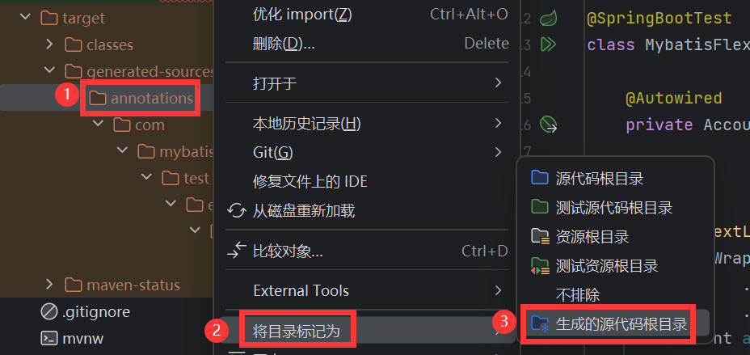

# 常见问题

[[toc]]

## MyBatis-Flex 没有启动或者启动出错怎么办？

正常情况下，MyBatis-Flex 在启动时，会在控制台打印如下 Banner 信息，包含版本与官方网址，如果在项目启动中没有发现 MyBatis-Flex 的 Banner 打印，那就说明 MyBatis-Flex 没有被正常加载。

```txt
  __  __       _           _   _       _____ _
 |  \/  |_   _| |__   __ _| |_(_)___  |  ___| | _____  __
 | |\/| | | | | '_ \ / _` | __| / __| | |_  | |/ _ \ \/ /
 | |  | | |_| | |_) | (_| | |_| \__ \ |  _| | |  __/>  <
 |_|  |_|\__, |_.__/ \__,_|\__|_|___/ |_|   |_|\___/_/\_\
         |___/ v1.5.4 https://mybatis-flex.com
```

需要做如下排查：

- 1、是否添加了数据源（Druid、HikariCP 等）依赖，或者添加了错误的数据源依赖版本。比如 SpringBoot v2.x 使用 HikariCP 时，应该是 HikariCP 的 4.x 版本。而 SpringBoot v3.x 应该使用
  HikariCP 的 5.x 版本。
- 2、是否主动添加了 `mybatis-spring-boot-starter` 的依赖，导致版本不匹配。使用 SpringBoot 的情况下，应该引用 `mybatis-flex-spring-boot-starter`
  就可以了，不需要再添加其他 MyBatis 依赖。
- 3、是否与 `mybatis-plus-boot-starter` 共用，使 MyBatis 被优先初始化，而导致 MyBatis-Flex 没有被加载。
- 4、是否添加了 `pagehelper-spring-boot-starter` 依赖，导致传递了 `mybatis-spring-boot-starter` 依赖。如还想继续使用 pagehelper 插件，点击 [这里](#与-pagehelper-集成出现错误) 查看解决方案。
- 5、是否 Spring Boot 版本过低，请使用 Spring Boot 2.2 及其以上版本，点击 [这里](#springboot-项目-启动报错-java-lang-classnotfoundexception-org-springframework-transaction-transactionmanager) 获取详细信息。

## 示例中的 AccountMapper 和 "ACCOUNT" 在哪里，报错了。

MyBatis-Flex 使用了 APT 技术，这两个类是自动生成的，需要编译一下项目。如果已经生成但是导入不了，按如下方法将 `target/generated-sources/annotations` 目录标记一下即可。



参考：[MyBatis-Flex APT 配置 - MyBatis-Flex 官方网站](./others/apt.md)

## 与 spring-data 整合输出 trationDelegate$BeanPostProcessorChecker 警告

```text
Bean 'x' of type [x] is not eligible for getting processed by all BeanPostProcessors (for example: not eligible for auto-proxying). Is this bean getting eagerly injected into a currently created BeanPostProcessor [projectingArgumentResolverBeanPostProcessor]? Check the corresponding BeanPostProcessor declaration and its dependencies.
```

排除 `SpringDataWebAutoConfiguration` 自动配置类即可：

```java
@SpringBootApplication(exclude = SpringDataWebAutoConfiguration.class)
public class SampleApplication {}
```

如果还是有警告，直接将日志级别改成 ERROR：

```yaml
logging:
  level:
    org.springframework.context.support.PostProcessorRegistrationDelegate: error
```

## 阿里镜像找不到依赖？

```txt
Could not find artifact com.mybatis-flex:mybatis-flex-spring-boot-starter:pom:1.x.x
in alimaven (http://maven.aliyun.com/nexus/content/groups/public/)
```

这个是因为目前阿里云镜像正在维护，可以替换为`腾讯云`或者`华为云`的镜像源，更改 Maven 安装目录下的 `settings.xml` 文件，
添加如下配置：

腾讯云：

```xml
<mirror>
    <id>tencent-cloud</id>
    <mirrorOf>*</mirrorOf>
    <name>tencent-cloud</name>
    <url>https://mirrors.cloud.tencent.com/nexus/repository/maven-public/</url>
</mirror>
```

华为云：

```xml
<mirror>
    <id>huawei-cloud</id>
    <mirrorOf>*</mirrorOf>
    <name>huawei-cloud</name>
    <url>https://mirrors.huaweicloud.com/repository/maven/</url>
</mirror>
```

## SpringBoot 3.2 项目，启动报错 Invalid value type for attribute 'factoryBeanObjectType': java.lang.String

这个是 `mybatis-spring` 依赖版本过低造成的，需要使用 springboot 3 对应的 starter 依赖。

```xml 3
<dependency>
    <groupId>com.mybatis-flex</groupId>
    <artifactId>mybatis-flex-spring-boot3-starter</artifactId>
    <version>${mybatis-flex.version}</version>
</dependency>
```

## SpringBoot 项目，启动报错 java.lang.ClassNotFoundException: org.springframework.transaction.TransactionManager

这个应该是 Spring Boot 版本的问题，`org.springframework.transaction.TransactionManager` 这个类是 Spring Framework 5.2
新增的，对应 Spring Boot 的版本应该是 Spring Boot 2.2 及其以上版本，所以应该使用 Spring Boot 2.2 及其以上版本。

## SpringBoot 项目，启动报错 Property 'sqlSessionFactory' or 'sqlSessionTemplate' are required

如果当前依赖没有连接池相关依赖，则建议添加 HikariCP 依赖。

SpringBoot v2.x 添加 hikariCP 的内容如下：

```xml
<dependency>
    <groupId>com.zaxxer</groupId>
    <artifactId>HikariCP</artifactId>
    <version>4.0.3</version>
</dependency>
```

SpringBoot v3.x 添加 hikariCP 的内容如下：

```xml
<dependency>
    <groupId>com.zaxxer</groupId>
    <artifactId>HikariCP</artifactId>
    <version>5.0.1</version>
</dependency>
```

> 如果使用的是 druid 数据库连接池，则需要添加数据源类型的配置 `spring.datasource.type=com.alibaba.druid.pool.DruidDataSource`。

## SpringBoot 项目中出现 class "com.xxx" cannot be cast class "com.xxx" 的错误

这个问题是由于 Spring 的 devtools 热加载引起的，可以在项目的 `resources/META-INF`
目录下创建一个名为 `spring-devtools.properties` 的配置文件，配置内容如下：

```properties
restart.include.mapper=/mapper-[\\w-\\.].jar
restart.include.pagehelper=/pagehelper-[\\w-\\.].jar
restart.include.mybatis-flex=/mybatis-flex-[\\w-\\.]+jar
```
相关文档参考 Spring 的官方网站：https://docs.spring.io/spring-boot/docs/current/reference/htmlsingle/#using.devtools.restart.customizing-the-classload


## SpringBoot 项目中出现 java.lang.IllegalArgumentException: object is not an instance of declaring class 的错误

这个问题也是由于 Spring 的 devtools 热加载引起的，解决办法参考 [上述问题](#springboot-项目中出现-class-comxxx-cannot-be-cast-class-comxxx-的错误)。

## java.sql.SQLException: No value specified for parameter x
出现这个问题，原因是 MyBatis-Flex 未能正常启动，SQL 执行没有经过 MyBatis-Flex 导致的。其直接是因为和其他第三方增强框架整合使用了，
比如和 MyBatis-Plus、或者 PageHelper 等整合造成的。

如何与 PageHelper 整合可以点击 [这里](/zh/faq.html#%E4%B8%8E-pagehelper-%E9%9B%86%E6%88%90%E5%87%BA%E7%8E%B0%E9%94%99%E8%AF%AF) 查看


## 整合 Springboot 3 出现 ClassNotFoundException： NestedIOException 的错误

需要使用 springboot 3 对应的 starter 依赖。

```xml 3
<dependency>
    <groupId>com.mybatis-flex</groupId>
    <artifactId>mybatis-flex-spring-boot3-starter</artifactId>
    <version>${mybatis-flex.version}</version>
</dependency>
```


## Spring 下使用 Druid 数据源无法启动

原因是在数据源的配置中，未添加 `type` 字段的配置：

```yaml:line-numbers 3
spring:
  datasource:
    type: com.alibaba.druid.pool.DruidDataSource
    url: jdbc:mysql://127.0.0.1:3306/dbtest
    username: root
    password: 123456
```
第 3 行中的 `type` 字段不能为空，这个并非是 MyBaits-Flex 的问题，而是 Spring 没有内置对 Druid 数据源类型
的主动发现机制。若使用 `hikariCP` 数据源，则可以不配置 `type` 内容。

> 若把数据源配置到 `mybatis-flex.datasource` 下，使用 mybatis-flex 的数据源发现机制，
> 使用 druid 则可以不用配置 type，更多文档参考：[多数据源章节](./core/multi-datasource.md)。

## 与 PageHelper 集成出现错误

在社区中，一些老的项目在使用到了开源项目 PageHelper，用于解决 xml 的分页问题，在和 MyBatis-flex
整合使用中，出现了一些错误，原因是 `pagehelper-spring-boot-starter` 依赖了 `mybatis-spring-boot-starter`，
此时需要把 `pagehelper-spring-boot-starter` 依赖替换为 `pagehelper`，然后手动添加 `PageInterceptor`。


```xml
<dependency>
    <groupId>com.github.pagehelper</groupId>
    <artifactId>pagehelper-spring-boot-starter</artifactId>
    <version>版本号</version>
</dependency>
```
需要把以上依赖替换如下：

```xml
<dependency>
    <groupId>com.github.pagehelper</groupId>
    <artifactId>pagehelper</artifactId>
    <version>5.3.3</version>
</dependency>
```
解决方案：https://gitee.com/mybatis-flex/mybatis-flex/issues/I71AUE


## 代码生成器获取不到注释

如果是 MySQL 数据库的话，可能是因为数据库版本太低，解决办法：在 jdbcUrl 设置参数 `useInformationSchema=true` 才能获取到注释。

例如：`jdbc:mysql://127.0.0.1:3306/mybatis-flex?characterEncoding=UTF-8&useInformationSchema=true`


如果是 Oracle， 则需要添加参数 `remarksReporting=true` ，例如：`jdbc:oracle:thin:@localhost:1521:orcl?remarksReporting=true`

## 与 Nacos 集成时出错，无法正常启动 MyBatis-Flex

一般情况下，是因为缺少 Nacos 的相关 Maven，注意添加如下的 Nacos 依赖：

```xml
<dependency>
    <groupId>com.alibaba.cloud</groupId>
    <artifactId>spring-cloud-starter-alibaba-nacos-config</artifactId>
    <version>2022.0.0.0</version>
</dependency>
```

## 如何自定义 MyBatis 的 Configuration?

1、在不使用 Spring 的场景下：

```java
FlexConfiguration configuration = new FlexConfiguration();
MybatisFlexBootstrap.getInstance().setConfiguration(configuration);
```

2、在使用 SpringBoot 的场景下：

```java
@Configuration
public class MyConfigurationCustomizer implements ConfigurationCustomizer {

    @Override
    public void customize(FlexConfiguration configuration) {
        // 在这里为 configuration 进行配置
        configuration.setLogImpl(StdOutImpl.class);
    }
}
```

3、只使用 Spring（不使用 SpringBoot ） 的场景：

```java
@Bean
public SqlSessionFactory sqlSessionFactory(DataSource dataSource) throws Exception {
    SqlSessionFactoryBean factoryBean = new FlexSqlSessionFactoryBean();
    factoryBean.setDataSource(dataSource);

    // 在这里配置
    FlexConfiguration configuration = new FlexConfiguration();
    configuration.setLogImpl(StdOutImpl.class);

    factoryBean.setConfiguration(configuration);
    return factoryBean.getObject();
}
```

## 如何在插入数据成功时，获得到主键内容？

在 MyBatis-Flex 中，一个主键没有赋值的 Entity（主键内容为空），通过 BaseMapper 插入成功后，其主键会自动被赋值，例如：

```java
//创建一个没有 id 内容的 account
Account account = new Account();
account.setUserName("michael");

//插入数据
accountMapper.insert(account);

//插入成功后，其 id 自动被赋值
System.out.println("插入成功的 Account 的 id: " + account.getId());
```

如果使用 Db + Row，代码如下：

```java
//创建一个 row，并设置其主键类型为自增，主键字段名称为 id
Row row = Row.ofKey(RowKey.AUTO);
row.set("user_name", "michael");

//插入数据
Db.insert("tb_account", row);

//插入成功后，其 id 自动被赋值
System.out.println("插入成功的主键: " + row.get("id"));
```

**RowKey 的说明：**

RowKey 内部定义了 4 个常量，分别为
- `AUTO`：字段名称为 id，类型为自增。
- `UUID`：字段名称为 id，类型为 uuid。
- `FLEX_ID`：字段名称为 id，类型为 flexId。
- `SNOW_FLAKE_ID`，：字段名称为 id，类型为雪花算法。

如果表的主键名称不是 id，或者主键的生成类型并非以上的 4 种类型，则需要我们自定义 RowKey，可以通过 `RowKey.of()` 方法来自定自己的主键名称和类型。
例如：


```java
//创建一个 rowKey，字段名称为 my_id，生成类型为雪花算法。
//整个应用全局定义一个静态变量，然后所有 row 复用就可以
RowKey rowKey = RowKey.of("my_id"
    , KeyType.Generator
    , KeyGenerators.snowFlakeId);

Row row = Row.ofKey(rowKey);
row.set("user_name", "michael");

//插入数据
Db.insert("tb_account", row);

//插入成功后，其 my_id 自动被赋值
System.out.println("插入成功的主键: " + row.get("my_id"));
```

## 如何替换 Ruoyi 项目中的 MyBatis 为 MyBatis-Flex ?

参考 issue：https://gitee.com/mybatis-flex/mybatis-flex/issues/I7UX96


## MyBatis-Flex 如何 activiti6 以及 Flowable 等工作流引擎集成？

当 MyBatis-Flex 与 activiti6 （或者 Flowable）集成时，需要覆盖其自动配置；添加 mybatis-flex 的事务管理器（FlexTransactionManager）和 DataSource（FlexDataSource）
注入到 ProcessEngineConfiguration，配置代码如下：

```java
@Bean
public ProcessEngineConfiguration processEngineConfiguration(
        SqlSessionFactory sqlSessionFactory,
        PlatformTransactionManager annotationDrivenTransactionManager) {

    SpringProcessEngineConfiguration processEngineConfiguration = new SpringProcessEngineConfiguration();

    // 指定 MyBatis-Flex  数据源
    processEngineConfiguration.setDataSource(sqlSessionFactory.getConfiguration().getEnvironment().getDataSource());

    // 配置 MyBatis-Flex  的事务管理器
    processEngineConfiguration.setTransactionManager(annotationDrivenTransactionManager);
    ...
}
```
