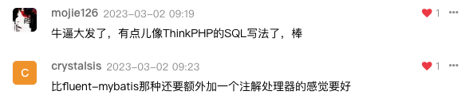

# Mybatis-Flex 是什么

Mybatis-Flex 是一个优雅的 Mybatis 增强框架，它非常轻量、同时拥有极高的性能与灵活性。我们可以轻松的使用 Mybaits-Flex 链接任何数据库，其内置的
QueryWrapper<Badge type="tip" text="^亮点" /> 帮助我们极大的减少了 SQL 编写的工作的同时，减少出错的可能性。

总而言之，Mybatis-Flex 能够极大地提高我们的开发效率和开发体验，让我们有更多的时间专注于自己的事情。

## 特征

**1、轻量**：除了 MyBatis，没有任何第三方依赖<Badge type="tip" text="轻依赖" />、没有任何拦截器，其原理是通过 SqlProvider 的方式实现的<Badge type="tip" text="轻实现" />。同时，在执行的过程中，没有任何的 Sql 解析（Parse）<Badge type="tip" text="轻运行" />。
这带来了几个好处：1、极高的性能；2、极易对代码进行跟踪和调试； 3、把控性更高。

**2、灵活**：支持 Entity 的增删改查、以及分页查询的同时，Mybatis-Flex 提供了 Db + Row<Badge type="tip" text="^灵活" /> 工具，可以无需实体类对数据库进行增删改查以及分页查询。
与此同时，Mybatis-Flex 内置的 QueryWrapper<Badge type="tip" text="^灵活" /> 可以轻易的帮助我们实现 **多表查询**、**链接查询**、**子查询** 等等常见的 SQL 场景。

**3、强大**：支持任意关系型数据库，还可以通过方言持续扩展，同时支持 **多（复合）主键**、**逻辑删除**、**乐观锁配置**、**数据脱敏**、**数据审计**、
**数据填充** 等等功能。

## 一些评价

---

---

--- 

--- 

