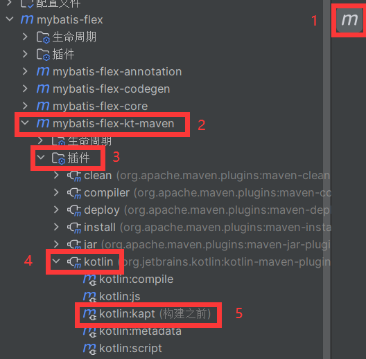

# 在 Kotlin 中使用注解处理器

> 在 Kotlin 中想要使 `@Table` 等注解生效十分简单。只需要使用 KAPT 即可。

## 在 Gradle 中使用

1、应用 Gradle 插件：`kotlin-kapt`

**【Kotlin】**

```kotlin
plugins {
    kotlin("kapt") version "1.9.1"
}
```

**【Groovy】**

```groovy
plugins {
    id 'org.jetbrains.kotlin.kapt' version '1.9.1'
}
```

2、在 dependencies 块中使用 kapt 配置添加相应的依赖项

**【Kotlin】**

```kotlin
dependencies {
    kapt("com.mybatis-flex:mybatis-flex-processor:1.5.6")
}
```

**【Groovy】**

```groovy
dependencies {
    kapt 'com.mybatis-flex:mybatis-flex-processor:1.5.6'
}
```

## 在 Maven 中使用

1、 将以下kapt配置插入指定位置。

```xml
<execution>
    <id>kapt</id>
    <goals>
        <goal>kapt</goal>
    </goals>
    <configuration>
        <annotationProcessorPaths>
            <path>
                <groupId>com.mybatis-flex</groupId>
                <artifactId>mybatis-flex-processor</artifactId>
                <version>1.5.6</version>
            </path>
        </annotationProcessorPaths>
    </configuration>
</execution>
```

你需要使 KAPT 在 compile 前工作，将其插入到 `kotlin-maven-plugin` 中的 compile 前，然后将 compile 的时机改为 `process-sources`

```xml
<plugin>
    <groupId>org.jetbrains.kotlin</groupId>
    <artifactId>kotlin-maven-plugin</artifactId>
    <version>${kotlin.version}</version>
    <executions>
        <!--上述代码需插入到此处，compile前-->
        <execution>
            <id>compile</id>
            <!--将此处的phase改为process-sources-->
            <phase>process-sources</phase>
            <goals>
                <goal>compile</goal>
            </goals>
        </execution>
        <execution>
            <id>test-compile</id>
            <phase>test-compile</phase>
            <goals>
                <goal>test-compile</goal>
            </goals>
        </execution>
    </executions>
</plugin>
```

2、 令 KAPT 在构建前运行

以 IDEA 举例：

1. 点击 Maven 图标
2. 找到对应项目
3. 点击插件
4. 点击 kotlin
5. 右击 kotlin:kapt，在选项中点击“**构建前执行**”，以让 KAPT 能够正确的生成代码。



> 关于 KAPT 更详细的说明，请看[Kotlin官网说明](https://book.kotlincn.net/text/kapt.html)，或[Kotlin语言中文站](https://www.kotlincn.net/docs/reference/kapt.html)。
