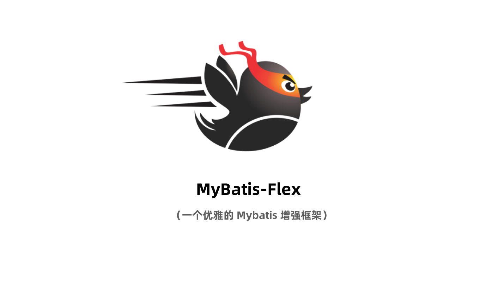

# Mybatis-Flex is an elegant Mybatis Enhancement Framework.

## Features

- 1、Mybatis-Flex is very lightweight, and it only depends on Mybatis and no other third-party dependencies
- 2、Basic CRUD operator and paging query of Entity class
- 3、Row mapping support, you can add, delete, modify and query the database without entity classes
- 4、Support multiple databases, and expand through dialects flexibly.
- 5、Support combined primary keys and different primary key content generation strategies
- 6、Extremely friendly SQL query, IDE automatically prompts and no worries about mistakes
- 7、More little surprises

## hello world（Without Spring）

**step 1: write entity class**

```java

@Table("tb_account")
public class Account {

    @Id()
    private Long id;
    private String userName;
    private Date birthday;
    private int sex;

    //getter setter
}
```

**step 2: write mapper class(it needs extends BaseMapper)**

```java
public interface AccountMapper extends BaseMapper<Account> {
    //only Mapper interface define.
}
```

**step 3: start query data**

e.g. 1： query by primary key

```java
class HelloWorld {
    public static void main(String... args) {

        HikariDataSource dataSource = new HikariDataSource();
        dataSource.setJdbcUrl("jdbc:mysql://127.0.0.1:3306/mybatis-flex");
        dataSource.setUsername("username");
        dataSource.setPassword("password");

        MybatisFlexBootstrap.getInstance()
                .setDatasource(dataSource)
                .addMapper(AccountMapper.class)
                .start();


        //id=100
        Account account = MybatisFlexBootstrap.getInstance()
                .execute(AccountMapper.class, mapper ->
                        mapper.selectOneById(100)
                );
    }
}
```

e.g.2: query list

```java
//use QueryWrapper to build query conditions
QueryWrapper query = QueryWrapper.create()
        .select()
        .from(ACCOUNT)
        .where(ACCOUNT.ID.ge(100))
        .and(ACCOUNT.USER_NAME.like("zhang").or(ACCOUNT.USER_NAME.like("li")));

// execute SQL：
// ELECT * FROM `tb_account`
// WHERE `tb_account`.`id` >=  100
// AND (`tb_account`.`user_name` LIKE '%zhang%' OR `tb_account`.`user_name` LIKE '%li%' )
List<Account> accounts = MybatisFlexBootstrap.getInstance()
        .execute(AccountMapper.class, mapper ->
                mapper.selectListByQuery(query)
        );
```

e.g.3: paging query

```java
//use QueryWrapper to build query conditions
QueryWrapper query = QueryWrapper.create()
        .select()
        .from(ACCOUNT)
        .where(ACCOUNT.ID.ge(100))
        .and(ACCOUNT.USER_NAME.like("zhang").or(ACCOUNT.USER_NAME.like("li")))
        .orderBy(ACCOUNT.ID.desc());

// execute SQL：
// ELECT * FROM `tb_account`
// WHERE `tb_account`.`id` >=  100
// AND (`tb_account`.`user_name` LIKE '%zhang%' OR `tb_account`.`user_name` LIKE '%li%' )
// ORDER BY `tb_account`.`id` DESC
// LIMIT 40,10
Page<Account> accountPage = MybatisFlexBootstrap.getInstance()
        .execute(AccountMapper.class, mapper ->
                mapper.paginate(5, 10, query)
        );
```

## QueryWrapper Samples

### select *

```java
QueryWrapper query=new QueryWrapper();
query.select().from(ACCOUNT)

// SQL: 
// SELECT * FROM tb_account
```

### select columns

```java
QueryWrapper query=new QueryWrapper();
query.select(ACCOUNT.ID,ACCOUNT.USER_NAME).from(ACCOUNT)

// SQL: 
// SELECT tb_account.id, tb_account.user_name 
// FROM tb_account
```

```java
QueryWrapper query=new QueryWrapper();
query.select(ACCOUNT.ALL_COLUMNS).from(ACCOUNT)

// SQL: 
// SELECT tb_account.id, tb_account.user_name, tb_account.birthday, 
// tb_account.sex, tb_account.is_normal 
// FROM tb_account
```

### select functions

```java
 QueryWrapper query=new QueryWrapper()
        .select(
            ACCOUNT.ID,
            ACCOUNT.USER_NAME,
            max(ACCOUNT.BIRTHDAY),
            avg(ACCOUNT.SEX).as("sex_avg")
        ).from(ACCOUNT);

// SQL: 
// SELECT tb_account.id, tb_account.user_name, 
// MAX(tb_account.birthday), 
// AVG(tb_account.sex) AS sex_avg 
// FROM tb_account
```

### where

```java
QueryWrapper queryWrapper=QueryWrapper.create()
    .select()
    .from(ACCOUNT)
    .where(ACCOUNT.ID.ge(100))
    .and(ACCOUNT.USER_NAME.like("michael"));

// SQL: 
// SELECT * FROM tb_account 
// WHERE tb_account.id >=  ?  
// AND tb_account.user_name LIKE  ? 
```

### exists, not exists

```java
QueryWrapper queryWrapper=QueryWrapper.create()
    .select()
    .from(ACCOUNT)
    .where(ACCOUNT.ID.ge(100))
    .and(
        exist(
            selectOne().from(ARTICLE).where(ARTICLE.ID.ge(100))
        )
    );

// SQL: 
// SELECT * FROM tb_account 
// WHERE tb_account.id >=  ?  
// AND EXIST (
//  SELECT 1 FROM tb_article WHERE tb_article.id >=  ? 
// )
```

### and (...) or (...)

```java
QueryWrapper queryWrapper=QueryWrapper.create()
    .select()
    .from(ACCOUNT)
    .where(ACCOUNT.ID.ge(100))
    .and(ACCOUNT.SEX.eq(1).or(ACCOUNT.SEX.eq(2)))
    .or(ACCOUNT.AGE.in(18,19,20).or(ACCOUNT.USER_NAME.like("michael")));

// SQL: 
// SELECT * FROM tb_account 
// WHERE tb_account.id >=  ?  
// AND (tb_account.sex =  ?  OR tb_account.sex =  ? ) 
// OR (tb_account.age IN (?,?,?) OR tb_account.user_name LIKE  ? )
```

### group by

```java
QueryWrapper queryWrapper=QueryWrapper.create()
    .select()
    .from(ACCOUNT)
    .groupBy(ACCOUNT.USER_NAME);

// SQL: 
// SELECT * FROM tb_account 
// GROUP BY tb_account.user_name
```

### having

```java
QueryWrapper queryWrapper=QueryWrapper.create()
    .select()
    .from(ACCOUNT)
    .groupBy(ACCOUNT.USER_NAME)
    .having(ACCOUNT.AGE.between(18,25));

// SQL: 
// SELECT * FROM tb_account 
// GROUP BY tb_account.user_name 
// HAVING tb_account.age BETWEEN  ? AND ?
```


### orderBy

```java
QueryWrapper queryWrapper=QueryWrapper.create()
        .select()
        .from(ACCOUNT)
        .orderBy(ACCOUNT.AGE.asc(), ACCOUNT.USER_NAME.desc().nullsLast());

// SQL: 
// SELECT * FROM `tb_account` 
// ORDER BY `age` ASC, `user_name` DESC NULLS LAST
```


### join
```java
QueryWrapper queryWrapper = QueryWrapper.create()
    .select()
    .from(ACCOUNT)
    .leftJoin(ARTICLE).on(ACCOUNT.ID.eq(ARTICLE.ACCOUNT_ID))
    .where(ACCOUNT.AGE.ge(10));

// SQL: 
// SELECT * FROM tb_account 
// LEFT JOIN tb_article 
// ON tb_account.id = tb_article.account_id 
// WHERE tb_account.age >=  ?
```


### limit... offset

```java
QueryWrapper queryWrapper = QueryWrapper.create()
    .select()
    .from(ACCOUNT)
    .orderBy(ACCOUNT.ID.desc())
    .limit(10)
    .offset(20);

// MySql: 
// SELECT * FROM `tb_account` ORDER BY `id` DESC LIMIT 20, 10

// postgreSQL: 
// SELECT * FROM "tb_account" ORDER BY "id" DESC LIMIT 20 OFFSET 10

// informix: 
// SELECT SKIP 20 FIRST 10 * FROM "tb_account" ORDER BY "id" DESC

// oracle: 
// SELECT * FROM (SELECT TEMP_DATAS.*, 
//  ROWNUM RN FROM (
//          SELECT * FROM "tb_account" ORDER BY "id" DESC) 
//      TEMP_DATAS WHERE  ROWNUM <=30) 
//  WHERE RN >20

// db2: 
// SELECT * FROM "tb_account" ORDER BY "id" DESC 
// OFFSET 20 ROWS FETCH NEXT 10 ROWS ONLY

// sybase: 
// SELECT TOP 10 START AT 30 * FROM "tb_account" ORDER BY "id" DESC

// firebird: 
// SELECT * FROM "tb_account" ORDER BY "id" DESC ROWS 20 TO 30
```

> 在以上的 "limit... offset" 示例中，Mybatis-Flex 能够自动识别当前数据库，并生成不同的 SQL，用户也可以很轻易的通过
> `DialectFactory` 注册（新增或改写）自己的实现方言。

### Questions？

**1、how to generate "ACCOUNT" class for QueryWrapper by Account.java ?**

build the project by IDE, or execute maven build command: `mvn clean package`


## More Samples

- 1、[Mybatis-Flex Only (Native)](./mybatis-flex-test/mybatis-flex-native-test)
- 2、[Mybatis-Flex with Spring](./mybatis-flex-test/mybatis-flex-spring-test)
- 3、[Mybatis-Flex with Spring boot](./mybatis-flex-test/mybatis-flex-spring-boot-test)


