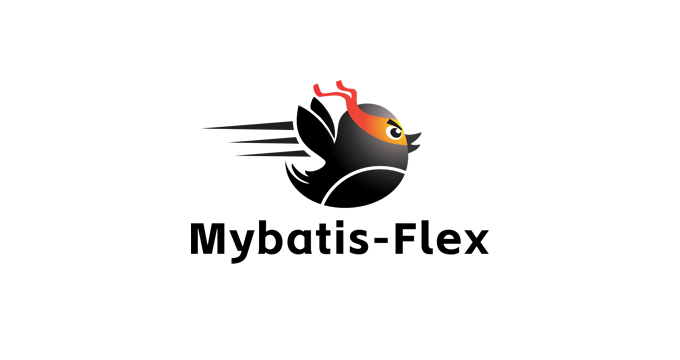
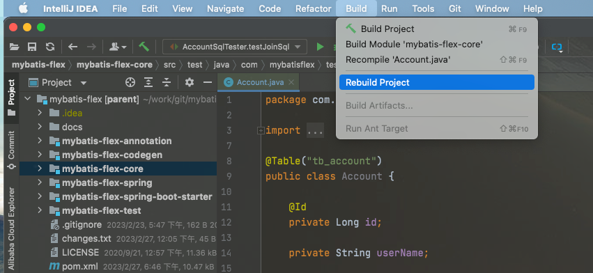

<!--@nrg.languages=en,zh-->
<!--@nrg.defaultLanguage=en-->
<!--@nrg.fileNamePattern.zh=readme_zh.md-->
<h4 align="right"><strong>English</strong> | <a href="./readme_zh.md">简体中文</a></h4><!--en-->
<!--en-->
<p align="center"><!--en-->
    <!--en-->
</p><!--en-->
<!--en-->
# MyBatis-Flex is an elegant Mybatis Enhancement Framework.<!--en-->
<!--en-->
<p align="center"><!--en-->
    <a target="_blank" href="https://search.maven.org/search?q=mybatis-flex%20mybatis-flex"><!--en-->
        <!--en-->
    </a><!--en-->
    <a target="_blank" href="https://www.apache.org/licenses/LICENSE-2.0.txt"><!--en-->
		<!--en-->
	</a><!--en-->
    <a target="_blank" href="https://www.oracle.com/java/technologies/javase/javase-jdk8-downloads.html"><!--en-->
		<!--en-->
	</a><!--en-->
    <a target="_blank" href="https://www.oracle.com/java/technologies/javase/jdk11-archive-downloads.html"><!--en-->
		<!--en-->
	</a><!--en-->
    <a target="_blank" href="https://www.oracle.com/java/technologies/javase/jdk17-archive-downloads.html"><!--en-->
		<!--en-->
	</a><!--en-->
    <a target="_blank" href="https://www.oracle.com/java/technologies/javase/jdk21-archive-downloads.html"><!--en-->
		<!--en-->
	</a><!--en-->
    <a target="_blank" href="https://www.oracle.com/java/technologies/javase/jdk25-archive-downloads.html"><!--en-->
		<!--en-->
	</a><!--en-->
    <br /><!--en-->
        <!--en-->
        <!--en-->
        <!--en-->
        <a target="_blank" href='https://github.com/noear/solon'></a><!--en-->
    <br /><!--en-->
    <a target="_blank" href='https://gitee.com/mybatis-flex/mybatis-flex'><!--en-->
		<!--en-->
	</a><!--en-->
    <a target="_blank" href='https://github.com/mybatis-flex/mybatis-flex'><!--en-->
		<!--en-->
	</a><!--en-->
</p><!--en-->
<!--en-->
## Features<!--en-->
<!--en-->
1. MyBatis-Flex is very lightweight, and it only depends on Mybatis and no other third-party dependencies<!--en-->
2. Basic CRUD operator and paging query of Entity class<!--en-->
3. Row mapping support, you can add, delete, modify and query the database without entity classes<!--en-->
4. Support multiple databases, and expand through dialects flexibly<!--en-->
5. Support combined primary keys and different primary key content generation strategies<!--en-->
6. Extremely friendly SQL query, IDE automatically prompts and no worries about mistakes<!--en-->
7. More little surprises<!--en-->
8. JSpecify nullness annotations for API hints (no checker included)<!--en-->
<!--en-->
## hello world(Without Spring)<!--en-->
<!--en-->
**step 1: write entity class**<!--en-->
<!--en-->
```java<!--en-->
@Table("tb_account")<!--en-->
public class Account {<!--en-->
<!--en-->
    @Id(keyType = KeyType.Auto)<!--en-->
    private Long id;<!--en-->
    private String userName;<!--en-->
    private Date birthday;<!--en-->
    private int sex;<!--en-->
<!--en-->
    // getter setter<!--en-->
}<!--en-->
```<!--en-->
<!--en-->
**step 2: write mapper class(it needs extends BaseMapper)**<!--en-->
<!--en-->
```java<!--en-->
public interface AccountMapper extends BaseMapper<Account> {<!--en-->
    // only Mapper interface define<!--en-->
}<!--en-->
```<!--en-->
<!--en-->
**step 3: start query data**<!--en-->
<!--en-->
e.g. 1: query by primary key<!--en-->
<!--en-->
```java<!--en-->
class HelloWorld {<!--en-->
    public static void main(String... args) {<!--en-->
<!--en-->
        HikariDataSource dataSource = new HikariDataSource();<!--en-->
        dataSource.setJdbcUrl("jdbc:mysql://127.0.0.1:3306/mybatis-flex");<!--en-->
        dataSource.setUsername("username");<!--en-->
        dataSource.setPassword("password");<!--en-->
<!--en-->
        MybatisFlexBootstrap.getInstance()<!--en-->
                .setDataSource(dataSource)<!--en-->
                .addMapper(AccountMapper.class)<!--en-->
                .start();<!--en-->
<!--en-->
        AccountMapper mapper = MybatisFlexBootstrap.getInstance()<!--en-->
                .getMapper(AccountMapper.class);<!--en-->
<!--en-->
<!--en-->
        // id = 100<!--en-->
        Account account = mapper.selectOneById(100);<!--en-->
    }<!--en-->
}<!--en-->
```<!--en-->
<!--en-->
e.g.2: query list<!--en-->
<!--en-->
```java<!--en-->
// use QueryWrapper to build query conditions<!--en-->
QueryWrapper query = QueryWrapper.create()<!--en-->
        .select()<!--en-->
        .from(ACCOUNT)<!--en-->
        .where(ACCOUNT.ID.ge(100))<!--en-->
        .and(ACCOUNT.USER_NAME.like("zhang").or(ACCOUNT.USER_NAME.like("li")));<!--en-->
<!--en-->
// execute SQL：<!--en-->
// SELECT * FROM tb_account<!--en-->
// WHERE tb_account.id >=  100<!--en-->
// AND (tb_account.user_name LIKE '%zhang%' OR tb_account.user_name LIKE '%li%' )<!--en-->
List<Account> accounts = mapper.selectListByQuery(query);<!--en-->
```<!--en-->
<!--en-->
e.g.3: paging query<!--en-->
<!--en-->
```java<!--en-->
// use QueryWrapper to build query conditions<!--en-->
QueryWrapper query = QueryWrapper.create()<!--en-->
        .select()<!--en-->
        .from(ACCOUNT)<!--en-->
        .where(ACCOUNT.ID.ge(100))<!--en-->
        .and(ACCOUNT.USER_NAME.like("zhang").or(ACCOUNT.USER_NAME.like("li")))<!--en-->
        .orderBy(ACCOUNT.ID.desc());<!--en-->
<!--en-->
// execute SQL：<!--en-->
// SELECT * FROM tb_account<!--en-->
// WHERE tb_account.id >=  100<!--en-->
// AND (tb_account.user_name LIKE '%zhang%' OR tb_account.user_name LIKE '%li%' )<!--en-->
// ORDER BY tb_account.id DESC<!--en-->
// LIMIT 40,10<!--en-->
Page<Account> accountPage = mapper.paginate(5, 10, query);<!--en-->
```<!--en-->
<!--en-->
## QueryWrapper Samples<!--en-->
<!--en-->
### select *<!--en-->
<!--en-->
```java<!--en-->
QueryWrapper query = new QueryWrapper();<!--en-->
query.select().from(ACCOUNT)<!--en-->
<!--en-->
// SQL:<!--en-->
// SELECT * FROM tb_account<!--en-->
```<!--en-->
<!--en-->
### select columns<!--en-->
<!--en-->
```java<!--en-->
QueryWrapper query = new QueryWrapper();<!--en-->
query.select(ACCOUNT.ID,ACCOUNT.USER_NAME).from(ACCOUNT)<!--en-->
<!--en-->
// SQL:<!--en-->
// SELECT tb_account.id, tb_account.user_name<!--en-->
// FROM tb_account<!--en-->
```<!--en-->
<!--en-->
<!--en-->
```java<!--en-->
QueryWrapper query = new QueryWrapper()<!--en-->
    .select(ACCOUNT.ID<!--en-->
        , ACCOUNT.USER_NAME<!--en-->
        , ARTICLE.ID.as("articleId")<!--en-->
        , ARTICLE.TITLE)<!--en-->
    .from(ACCOUNT.as("a"), ARTICLE.as("b"))<!--en-->
    .where(ACCOUNT.ID.eq(ARTICLE.ACCOUNT_ID));<!--en-->
<!--en-->
// SQL:<!--en-->
// SELECT a.id, a.user_name, b.id AS articleId, b.title<!--en-->
// FROM tb_account AS a, tb_article AS b<!--en-->
// WHERE a.id = b.account_id<!--en-->
```<!--en-->
<!--en-->
### select functions<!--en-->
<!--en-->
```java<!--en-->
 QueryWrapper query = new QueryWrapper()<!--en-->
        .select(<!--en-->
            ACCOUNT.ID,<!--en-->
            ACCOUNT.USER_NAME,<!--en-->
            max(ACCOUNT.BIRTHDAY),<!--en-->
            avg(ACCOUNT.SEX).as("sex_avg")<!--en-->
        ).from(ACCOUNT);<!--en-->
<!--en-->
// SQL:<!--en-->
// SELECT tb_account.id, tb_account.user_name,<!--en-->
// MAX(tb_account.birthday),<!--en-->
// AVG(tb_account.sex) AS sex_avg<!--en-->
// FROM tb_account<!--en-->
```<!--en-->
<!--en-->
### where<!--en-->
<!--en-->
```java<!--en-->
QueryWrapper queryWrapper = QueryWrapper.create()<!--en-->
    .select()<!--en-->
    .from(ACCOUNT)<!--en-->
    .where(ACCOUNT.ID.ge(100))<!--en-->
    .and(ACCOUNT.USER_NAME.like("michael"));<!--en-->
<!--en-->
// SQL:<!--en-->
// SELECT * FROM tb_account<!--en-->
// WHERE tb_account.id >=  ?<!--en-->
// AND tb_account.user_name LIKE  ?<!--en-->
```<!--en-->
<!--en-->
### exists, not exists<!--en-->
<!--en-->
```java<!--en-->
QueryWrapper queryWrapper = QueryWrapper.create()<!--en-->
    .select()<!--en-->
    .from(ACCOUNT)<!--en-->
    .where(ACCOUNT.ID.ge(100))<!--en-->
    .and(<!--en-->
        exists(<!--en-->
            selectOne().from(ARTICLE).where(ARTICLE.ID.ge(100))<!--en-->
        )<!--en-->
    );<!--en-->
<!--en-->
// SQL:<!--en-->
// SELECT * FROM tb_account<!--en-->
// WHERE tb_account.id >=  ?<!--en-->
// AND EXIST (<!--en-->
//  SELECT 1 FROM tb_article WHERE tb_article.id >=  ?<!--en-->
// )<!--en-->
```<!--en-->
<!--en-->
### and (...) or (...)<!--en-->
<!--en-->
```java<!--en-->
QueryWrapper queryWrapper = QueryWrapper.create()<!--en-->
    .select()<!--en-->
    .from(ACCOUNT)<!--en-->
    .where(ACCOUNT.ID.ge(100))<!--en-->
    .and(ACCOUNT.SEX.eq(1).or(ACCOUNT.SEX.eq(2)))<!--en-->
    .or(ACCOUNT.AGE.in(18,19,20).or(ACCOUNT.USER_NAME.like("michael")));<!--en-->
<!--en-->
// SQL:<!--en-->
// SELECT * FROM tb_account<!--en-->
// WHERE tb_account.id >=  ?<!--en-->
// AND (tb_account.sex =  ?  OR tb_account.sex =  ? )<!--en-->
// OR (tb_account.age IN (?,?,?) OR tb_account.user_name LIKE  ? )<!--en-->
```<!--en-->
<!--en-->
### group by<!--en-->
<!--en-->
```java<!--en-->
QueryWrapper queryWrapper = QueryWrapper.create()<!--en-->
    .select()<!--en-->
    .from(ACCOUNT)<!--en-->
    .groupBy(ACCOUNT.USER_NAME);<!--en-->
<!--en-->
// SQL:<!--en-->
// SELECT * FROM tb_account<!--en-->
// GROUP BY tb_account.user_name<!--en-->
```<!--en-->
<!--en-->
### having<!--en-->
<!--en-->
```java<!--en-->
QueryWrapper queryWrapper = QueryWrapper.create()<!--en-->
    .select()<!--en-->
    .from(ACCOUNT)<!--en-->
    .groupBy(ACCOUNT.USER_NAME)<!--en-->
    .having(ACCOUNT.AGE.between(18,25));<!--en-->
<!--en-->
// SQL:<!--en-->
// SELECT * FROM tb_account<!--en-->
// GROUP BY tb_account.user_name<!--en-->
// HAVING tb_account.age BETWEEN  ? AND ?<!--en-->
```<!--en-->
<!--en-->
<!--en-->
### orderBy<!--en-->
<!--en-->
```java<!--en-->
QueryWrapper queryWrapper = QueryWrapper.create()<!--en-->
        .select()<!--en-->
        .from(ACCOUNT)<!--en-->
        .orderBy(ACCOUNT.AGE.asc(), ACCOUNT.USER_NAME.desc().nullsLast());<!--en-->
<!--en-->
// SQL:<!--en-->
// SELECT * FROM tb_account<!--en-->
// ORDER BY age ASC, user_name DESC NULLS LAST<!--en-->
```<!--en-->
<!--en-->
<!--en-->
### join<!--en-->
```java<!--en-->
QueryWrapper queryWrapper = QueryWrapper.create()<!--en-->
    .select()<!--en-->
    .from(ACCOUNT)<!--en-->
    .leftJoin(ARTICLE).on(ACCOUNT.ID.eq(ARTICLE.ACCOUNT_ID))<!--en-->
    .where(ACCOUNT.AGE.ge(10));<!--en-->
<!--en-->
// SQL:<!--en-->
// SELECT * FROM tb_account<!--en-->
// LEFT JOIN tb_article<!--en-->
// ON tb_account.id = tb_article.account_id<!--en-->
// WHERE tb_account.age >=  ?<!--en-->
```<!--en-->
<!--en-->
<!--en-->
### limit... offset<!--en-->
<!--en-->
```java<!--en-->
QueryWrapper queryWrapper = QueryWrapper.create()<!--en-->
    .select()<!--en-->
    .from(ACCOUNT)<!--en-->
    .orderBy(ACCOUNT.ID.desc())<!--en-->
    .limit(10)<!--en-->
    .offset(20);<!--en-->
<!--en-->
// MySql:<!--en-->
// SELECT * FROM `tb_account` ORDER BY `id` DESC LIMIT 20, 10<!--en-->
<!--en-->
// PostgreSQL:<!--en-->
// SELECT * FROM "tb_account" ORDER BY "id" DESC LIMIT 20 OFFSET 10<!--en-->
<!--en-->
// Informix:<!--en-->
// SELECT SKIP 20 FIRST 10 * FROM "tb_account" ORDER BY "id" DESC<!--en-->
<!--en-->
// Oracle:<!--en-->
// SELECT * FROM (SELECT TEMP_DATAS.*,<!--en-->
//  ROWNUM RN FROM (<!--en-->
//          SELECT * FROM "tb_account" ORDER BY "id" DESC)<!--en-->
//      TEMP_DATAS WHERE  ROWNUM <=30)<!--en-->
//  WHERE RN >20<!--en-->
<!--en-->
// Db2:<!--en-->
// SELECT * FROM "tb_account" ORDER BY "id" DESC<!--en-->
// OFFSET 20 ROWS FETCH NEXT 10 ROWS ONLY<!--en-->
<!--en-->
// Sybase:<!--en-->
// SELECT TOP 10 START AT 21 * FROM "tb_account" ORDER BY "id" DESC<!--en-->
<!--en-->
// Firebird:<!--en-->
// SELECT * FROM "tb_account" ORDER BY "id" DESC ROWS 20 TO 30<!--en-->
```<!--en-->
<!--en-->
<!--en-->
### Questions？<!--en-->
<!--en-->
**1. How to generate "ACCOUNT" class for QueryWrapper by Account.java ?**<!--en-->
<!--en-->
Build the project by IDE, or execute maven build command: `mvn clean package`<!--en-->
<!--en-->
<!--en-->
<!--en-->
## More Samples<!--en-->
<!--en-->
1. [Mybatis-Flex Only (Native)](./mybatis-flex-test/mybatis-flex-native-test)<!--en-->
2. [Mybatis-Flex with Spring](./mybatis-flex-test/mybatis-flex-spring-test)<!--en-->
3. [Mybatis-Flex with Spring boot](./mybatis-flex-test/mybatis-flex-spring-boot-test)<!--en-->
<!--en-->
## Wechat Group<!--en-->
<!--en-->
<!--en-->
<!--en-->
<!--en-->
<h4 align="right"><a href="./readme.md">English</a> | <strong>简体中文</strong></h4><!--zh-->
<!--zh-->
<p align="center"><!--zh-->
    <!--zh-->
</p><!--zh-->
<!--zh-->
<!--zh-->
# MyBatis-Flex： 一个优雅的 MyBatis 增强框架<!--zh-->
<!--zh-->
<p align="center"><!--zh-->
    <a target="_blank" href="https://search.maven.org/search?q=mybatis-flex%20mybatis-flex"><!--zh-->
        <!--zh-->
    </a><!--zh-->
    <a target="_blank" href="https://www.apache.org/licenses/LICENSE-2.0.txt"><!--zh-->
		<!--zh-->
	</a><!--zh-->
    <a target="_blank" href="https://www.oracle.com/java/technologies/javase/javase-jdk8-downloads.html"><!--zh-->
		<!--zh-->
	</a><!--zh-->
    <a target="_blank" href="https://www.oracle.com/java/technologies/javase/jdk11-archive-downloads.html"><!--zh-->
		<!--zh-->
	</a><!--zh-->
    <a target="_blank" href="https://www.oracle.com/java/technologies/javase/jdk17-archive-downloads.html"><!--zh-->
		<!--zh-->
	</a><!--zh-->
    <a target="_blank" href="https://www.oracle.com/java/technologies/javase/jdk21-archive-downloads.html"><!--zh-->
		<!--zh-->
	</a><!--zh-->
    <a target="_blank" href="https://www.oracle.com/java/technologies/javase/jdk25-archive-downloads.html"><!--zh-->
		<!--zh-->
	</a><!--zh-->
    <br /><!--zh-->
        <!--zh-->
        <!--zh-->
        <!--zh-->
        <a target="_blank" href='https://gitee.com/noear/solon'></a><!--zh-->
    <br /><!--zh-->
    <a target="_blank" href='https://gitee.com/mybatis-flex/mybatis-flex'><!--zh-->
		<!--zh-->
	</a><!--zh-->
    <a target="_blank" href='https://github.com/mybatis-flex/mybatis-flex'><!--zh-->
		<!--zh-->
	</a><!--zh-->
</p><!--zh-->
<!--zh-->
## 特征<!--zh-->
<!--zh-->
#### 1. 很轻量<!--zh-->
> MyBatis-Flex 整个框架只依赖 MyBatis，再无其他任何第三方依赖。<!--zh-->
<!--zh-->
#### 2. 只增强<!--zh-->
> MyBatis-Flex  支持 CRUD、分页查询、多表查询、批量操作，但不丢失 MyBatis 原有的任何功能。<!--zh-->
<!--zh-->
#### 3. 高性能<!--zh-->
> MyBatis-Flex 采用独特的技术架构、相比许多同类框架，MyBatis-Flex 的在增删改查等方面的性能均超越其 5-10 倍或以上。<!--zh-->
<!--zh-->
#### 4. 更灵动<!--zh-->
> MyBatis-Flex 支持多主键、多表查询、逻辑删除、乐观锁、数据脱敏、数据加密、多数据源、分库分表、字段权限、字段加密、多租户、事务管理、SQL 审计等特性。 这一切，免费且灵动。<!--zh-->
<!--zh-->
#### 5. JSpecify 空值注解<!--zh-->
> 接口层提供 JSpecify 空值标注，用于 IDE/静态分析提示（不包含空值检查工具）。<!--zh-->
<!--zh-->
<!--zh-->
## Star 用户专属交流群群<!--zh-->
<!--zh-->
<!--zh-->
<!--zh-->
<!--zh-->
<!--zh-->
## 开始<!--zh-->
<!--zh-->
- [快速开始](https://mybatis-flex.com/zh/intro/getting-started.html)<!--zh-->
- 示例 1：[Mybatis-Flex 原生（非 Spring）](./mybatis-flex-test/mybatis-flex-native-test)<!--zh-->
- 示例 2：[Mybatis-Flex with Spring](./mybatis-flex-test/mybatis-flex-spring-test)<!--zh-->
- 示例 3：[Mybatis-Flex with Spring boot](./mybatis-flex-test/mybatis-flex-spring-boot-test)<!--zh-->
- 示例 4：[Db + Row](./mybatis-flex-test/mybatis-flex-native-test/src/main/java/com/mybatisflex/test/DbTestStarter.java)<!--zh-->
<!--zh-->
## hello world（原生）<!--zh-->
<!--zh-->
**第 1 步：编写 Entity 实体类**<!--zh-->
<!--zh-->
```java<!--zh-->
@Table("tb_account")<!--zh-->
public class Account {<!--zh-->
<!--zh-->
    @Id(keyType = KeyType.Auto)<!--zh-->
    private Long id;<!--zh-->
    private String userName;<!--zh-->
    private Date birthday;<!--zh-->
    private int sex;<!--zh-->
<!--zh-->
    // getter setter<!--zh-->
}<!--zh-->
```<!--zh-->
<!--zh-->
**第 2 步：开始查询数据**<!--zh-->
<!--zh-->
示例 1：查询 1 条数据<!--zh-->
<!--zh-->
```java<!--zh-->
class HelloWorld {<!--zh-->
    public static void main(String... args) {<!--zh-->
<!--zh-->
        HikariDataSource dataSource = new HikariDataSource();<!--zh-->
        dataSource.setJdbcUrl("jdbc:mysql://127.0.0.1:3306/mybatis-flex");<!--zh-->
        dataSource.setUsername("username");<!--zh-->
        dataSource.setPassword("password");<!--zh-->
<!--zh-->
        MybatisFlexBootstrap.getInstance()<!--zh-->
                .setDataSource(dataSource)<!--zh-->
                .addMapper(AccountMapper.class)<!--zh-->
                .start();<!--zh-->
<!--zh-->
        AccountMapper mapper = MybatisFlexBootstrap.getInstance()<!--zh-->
                .getMapper(AccountMapper.class);<!--zh-->
<!--zh-->
<!--zh-->
        // 示例1：查询 id = 100 条数据<!--zh-->
        Account account = mapper.selectOneById(100);<!--zh-->
    }<!--zh-->
}<!--zh-->
```<!--zh-->
<!--zh-->
> 以上的 `AccountMapper.class` 为 MyBatis-Flex 自动通过 APT 生成，无需手动编码。也可以关闭自动生成功能，手动编写 AccountMapper，更多查看 APT 文档。<!--zh-->
<!--zh-->
示例 2：查询列表<!--zh-->
<!--zh-->
```java<!--zh-->
// 示例 2：通过 QueryWrapper 构建条件查询数据列表<!--zh-->
QueryWrapper query = QueryWrapper.create()<!--zh-->
    .select()<!--zh-->
    .from(ACCOUNT) // 单表查询时表名可省略，自动使用 Mapper 泛型对应的表<!--zh-->
    .where(ACCOUNT.ID.ge(100))<!--zh-->
    .and(ACCOUNT.USER_NAME.like("张").or(ACCOUNT.USER_NAME.like("李")));<!--zh-->
<!--zh-->
// 执行 SQL：<!--zh-->
// SELECT * FROM tb_account<!--zh-->
// WHERE tb_account.id >=  100<!--zh-->
// AND (tb_account.user_name LIKE '%张%' OR tb_account.user_name LIKE '%李%' )<!--zh-->
List<Account> accounts = accountMapper.selectListByQuery(query);<!--zh-->
```<!--zh-->
<!--zh-->
示例 3：分页查询<!--zh-->
<!--zh-->
```java<!--zh-->
// 示例 3：分页查询<!--zh-->
// 查询第 5 页，每页 10 条数据，通过 QueryWrapper 构建条件查询<!--zh-->
QueryWrapper query=QueryWrapper.create()<!--zh-->
    .select()<!--zh-->
    .from(ACCOUNT)<!--zh-->
    .where(ACCOUNT.ID.ge(100))<!--zh-->
    .and(ACCOUNT.USER_NAME.like("张").or(ACCOUNT.USER_NAME.like("李")))<!--zh-->
    .orderBy(ACCOUNT.ID.desc());<!--zh-->
<!--zh-->
// 执行 SQL：<!--zh-->
// SELECT * FROM tb_account<!--zh-->
// WHERE id >=  100<!--zh-->
// AND (user_name LIKE '%张%' OR user_name LIKE '%李%' )<!--zh-->
// ORDER BY `id` DESC<!--zh-->
// LIMIT 40,10<!--zh-->
Page<Account> accounts = mapper.paginate(5, 10, query);<!--zh-->
```<!--zh-->
<!--zh-->
## QueryWrapper 示例<!--zh-->
<!--zh-->
### select *<!--zh-->
<!--zh-->
```java<!--zh-->
QueryWrapper query = new QueryWrapper();<!--zh-->
query.select().from(ACCOUNT);<!--zh-->
<!--zh-->
// SQL:<!--zh-->
// SELECT * FROM tb_account<!--zh-->
```<!--zh-->
也可以通过静态方法简写成如下两种形式，效果完全相同：<!--zh-->
```java<!--zh-->
// 方式1<!--zh-->
QueryWrapper query = QueryWrapper.create()<!--zh-->
        .select().from(ACCOUNT);<!--zh-->
// 方式2<!--zh-->
QueryWrapper query = select().from(ACCOUNT);<!--zh-->
<!--zh-->
// SQL:<!--zh-->
// SELECT * FROM tb_account<!--zh-->
```<!--zh-->
### select columns<!--zh-->
<!--zh-->
简单示例：<!--zh-->
```java<!--zh-->
QueryWrapper query = new QueryWrapper();<!--zh-->
query.select(ACCOUNT.ID, ACCOUNT.USER_NAME)<!--zh-->
    .from(ACCOUNT);<!--zh-->
<!--zh-->
// SQL:<!--zh-->
// SELECT id, user_name<!--zh-->
// FROM tb_account<!--zh-->
```<!--zh-->
<!--zh-->
多表查询（同时展现了功能强大的 `as` 能力）：<!--zh-->
```java<!--zh-->
QueryWrapper query = new QueryWrapper()<!--zh-->
    .select(ACCOUNT.ID<!--zh-->
        , ACCOUNT.USER_NAME<!--zh-->
        , ARTICLE.ID.as("articleId")<!--zh-->
        , ARTICLE.TITLE)<!--zh-->
    .from(ACCOUNT.as("a"), ARTICLE.as("b"))<!--zh-->
    .where(ACCOUNT.ID.eq(ARTICLE.ACCOUNT_ID));<!--zh-->
<!--zh-->
// SQL:<!--zh-->
// SELECT a.id, a.user_name, b.id AS articleId, b.title<!--zh-->
// FROM tb_account AS a, tb_article AS b<!--zh-->
// WHERE a.id = b.account_id<!--zh-->
```<!--zh-->
<!--zh-->
### select functions<!--zh-->
<!--zh-->
```java<!--zh-->
QueryWrapper query = new QueryWrapper()<!--zh-->
    .select(<!--zh-->
        ACCOUNT.ID,<!--zh-->
        ACCOUNT.USER_NAME,<!--zh-->
        max(ACCOUNT.BIRTHDAY),<!--zh-->
        avg(ACCOUNT.SEX).as("sex_avg")<!--zh-->
    ).from(ACCOUNT);<!--zh-->
<!--zh-->
// SQL:<!--zh-->
// SELECT id, user_name,<!--zh-->
// MAX(birthday),<!--zh-->
// AVG(sex) AS sex_avg<!--zh-->
// FROM tb_account<!--zh-->
```<!--zh-->
<!--zh-->
### where<!--zh-->
```java<!--zh-->
Integer num = 100;<!--zh-->
String userName = "michael";<!--zh-->
QueryWrapper queryWrapper = QueryWrapper.create()<!--zh-->
    .select()<!--zh-->
    .from(ACCOUNT)<!--zh-->
    .where(ACCOUNT.ID.ge(100))<!--zh-->
    .and(ACCOUNT.USER_NAME.like("michael"));<!--zh-->
<!--zh-->
// SQL:<!--zh-->
// SELECT * FROM tb_account<!--zh-->
// WHERE id >=  ?<!--zh-->
// AND user_name LIKE  ?<!--zh-->
```<!--zh-->
<!--zh-->
### where 动态条件 1<!--zh-->
<!--zh-->
```java<!--zh-->
boolean flag = false;<!--zh-->
QueryWrapper queryWrapper = QueryWrapper.create()<!--zh-->
    .select().from(ACCOUNT)<!--zh-->
    .where(flag ? ACCOUNT.ID.ge(100) : noCondition())<!--zh-->
    .and(ACCOUNT.USER_NAME.like("michael"));<!--zh-->
<!--zh-->
// SQL:<!--zh-->
// SELECT * FROM tb_account<!--zh-->
// WHERE user_name LIKE  ?<!--zh-->
```<!--zh-->
<!--zh-->
### where 动态条件 2<!--zh-->
<!--zh-->
```java<!--zh-->
boolean flag = false;<!--zh-->
QueryWrapper queryWrapper = QueryWrapper.create()<!--zh-->
    .select().from(ACCOUNT)<!--zh-->
    .where(ACCOUNT.ID.ge(100).when(flag))<!--zh-->
    .and(ACCOUNT.USER_NAME.like("michael"));<!--zh-->
<!--zh-->
// SQL:<!--zh-->
// SELECT * FROM tb_account<!--zh-->
// WHERE user_name LIKE  ?<!--zh-->
```<!--zh-->
### where 自动忽略 null 值<!--zh-->
当遇到条件值为 null 时，会自动忽略该条件，不会拼接到 SQL 中<!--zh-->
```java<!--zh-->
Integer num = null;<!--zh-->
String userName = "michael";<!--zh-->
QueryWrapper queryWrapper = QueryWrapper.create()<!--zh-->
    .select()<!--zh-->
    .from(ACCOUNT)<!--zh-->
    .where(ACCOUNT.ID.ge(num))<!--zh-->
    .and(ACCOUNT.USER_NAME.like(userName));<!--zh-->
<!--zh-->
// SQL:<!--zh-->
// SELECT * FROM tb_account<!--zh-->
// WHERE user_name LIKE '%michael%'<!--zh-->
```<!--zh-->
<!--zh-->
<!--zh-->
### where select<!--zh-->
```java<!--zh-->
QueryWrapper queryWrapper = QueryWrapper.create()<!--zh-->
    .select()<!--zh-->
    .from(ACCOUNT)<!--zh-->
    .where(ACCOUNT.ID.ge(<!--zh-->
       select(ARTICLE.ACCOUNT_ID).from(ARTICLE).where(ARTICLE.ID.ge(100))<!--zh-->
    ));<!--zh-->
<!--zh-->
// SQL:<!--zh-->
// SELECT * FROM tb_account<!--zh-->
// WHERE id >=<!--zh-->
// (SELECT account_id FROM tb_article WHERE id >=  ? )<!--zh-->
```<!--zh-->
<!--zh-->
### exists, not exists<!--zh-->
<!--zh-->
```java<!--zh-->
QueryWrapper queryWrapper = QueryWrapper.create()<!--zh-->
    .select()<!--zh-->
    .from(ACCOUNT)<!--zh-->
    .where(ACCOUNT.ID.ge(100))<!--zh-->
    .and(<!--zh-->
        exists(  // or notExists(...)<!--zh-->
            selectOne().from(ARTICLE).where(ARTICLE.ID.ge(100))<!--zh-->
        )<!--zh-->
    );<!--zh-->
<!--zh-->
// SQL:<!--zh-->
// SELECT * FROM tb_account<!--zh-->
// WHERE id >=  ?<!--zh-->
// AND EXIST (<!--zh-->
//    SELECT 1 FROM tb_article WHERE id >=  ?<!--zh-->
// )<!--zh-->
```<!--zh-->
<!--zh-->
### and (...) or (...)<!--zh-->
<!--zh-->
```java<!--zh-->
QueryWrapper queryWrapper = QueryWrapper.create()<!--zh-->
    .select()<!--zh-->
    .from(ACCOUNT)<!--zh-->
    .where(ACCOUNT.ID.ge(100))<!--zh-->
    .and(ACCOUNT.SEX.eq(1).or(ACCOUNT.SEX.eq(2)))<!--zh-->
    .or(ACCOUNT.AGE.in(18,19,20).and(ACCOUNT.USER_NAME.like("michael")));<!--zh-->
<!--zh-->
// SQL:<!--zh-->
// SELECT * FROM tb_account<!--zh-->
// WHERE id >=  ?<!--zh-->
// AND (sex =  ? OR sex =  ? )<!--zh-->
// OR (age IN (?,?,?) AND user_name LIKE ? )<!--zh-->
```<!--zh-->
<!--zh-->
### group by<!--zh-->
<!--zh-->
```java<!--zh-->
QueryWrapper queryWrapper = QueryWrapper.create()<!--zh-->
    .select()<!--zh-->
    .from(ACCOUNT)<!--zh-->
    .groupBy(ACCOUNT.USER_NAME);<!--zh-->
<!--zh-->
// SQL:<!--zh-->
// SELECT * FROM tb_account<!--zh-->
// GROUP BY user_name<!--zh-->
```<!--zh-->
<!--zh-->
### having<!--zh-->
<!--zh-->
```java<!--zh-->
QueryWrapper queryWrapper = QueryWrapper.create()<!--zh-->
    .select()<!--zh-->
    .from(ACCOUNT)<!--zh-->
    .groupBy(ACCOUNT.USER_NAME)<!--zh-->
    .having(ACCOUNT.AGE.between(18,25));<!--zh-->
<!--zh-->
// SQL:<!--zh-->
// SELECT * FROM tb_account<!--zh-->
// GROUP BY user_name<!--zh-->
// HAVING age BETWEEN  ? AND ?<!--zh-->
```<!--zh-->
<!--zh-->
### orderBy<!--zh-->
<!--zh-->
```java<!--zh-->
QueryWrapper queryWrapper = QueryWrapper.create()<!--zh-->
    .select()<!--zh-->
    .from(ACCOUNT)<!--zh-->
    .orderBy(ACCOUNT.AGE.asc()<!--zh-->
        , ACCOUNT.USER_NAME.desc().nullsLast());<!--zh-->
<!--zh-->
// SQL:<!--zh-->
// SELECT * FROM tb_account<!--zh-->
// ORDER BY age ASC, user_name DESC NULLS LAST<!--zh-->
```<!--zh-->
<!--zh-->
### join<!--zh-->
<!--zh-->
```java<!--zh-->
QueryWrapper queryWrapper = QueryWrapper.create()<!--zh-->
    .select()<!--zh-->
    .from(ACCOUNT)<!--zh-->
    .leftJoin(ARTICLE).on(ACCOUNT.ID.eq(ARTICLE.ACCOUNT_ID))<!--zh-->
    .innerJoin(ARTICLE).on(ACCOUNT.ID.eq(ARTICLE.ACCOUNT_ID))<!--zh-->
    .where(ACCOUNT.AGE.ge(10));<!--zh-->
<!--zh-->
// SQL:<!--zh-->
// SELECT * FROM tb_account<!--zh-->
// LEFT JOIN tb_article ON tb_account.id = tb_article.account_id<!--zh-->
// INNER JOIN tb_article ON tb_account.id = tb_article.account_id<!--zh-->
// WHERE tb_account.age >=  ?<!--zh-->
```<!--zh-->
<!--zh-->
<!--zh-->
### limit... offset<!--zh-->
<!--zh-->
```java<!--zh-->
QueryWrapper queryWrapper = QueryWrapper.create()<!--zh-->
    .select()<!--zh-->
    .from(ACCOUNT)<!--zh-->
    .orderBy(ACCOUNT.ID.desc())<!--zh-->
    .limit(10)<!--zh-->
    .offset(20);<!--zh-->
<!--zh-->
// MySql:<!--zh-->
// SELECT * FROM `tb_account` ORDER BY `id` DESC LIMIT 20, 10<!--zh-->
<!--zh-->
// PostgreSQL:<!--zh-->
// SELECT * FROM "tb_account" ORDER BY "id" DESC LIMIT 20 OFFSET 10<!--zh-->
<!--zh-->
// Informix:<!--zh-->
// SELECT SKIP 20 FIRST 10 * FROM "tb_account" ORDER BY "id" DESC<!--zh-->
<!--zh-->
// Oracle:<!--zh-->
// SELECT * FROM (SELECT TEMP_DATAS.*,<!--zh-->
//  ROWNUM RN FROM (<!--zh-->
//          SELECT * FROM "tb_account" ORDER BY "id" DESC)<!--zh-->
//      TEMP_DATAS WHERE  ROWNUM <=30)<!--zh-->
//  WHERE RN >20<!--zh-->
<!--zh-->
// Db2:<!--zh-->
// SELECT * FROM "tb_account" ORDER BY "id" DESC<!--zh-->
// OFFSET 20 ROWS FETCH NEXT 10 ROWS ONLY<!--zh-->
<!--zh-->
// Sybase:<!--zh-->
// SELECT TOP 10 START AT 21 * FROM "tb_account" ORDER BY "id" DESC<!--zh-->
<!--zh-->
// Firebird:<!--zh-->
// SELECT * FROM "tb_account" ORDER BY "id" DESC ROWS 20 TO 30<!--zh-->
```<!--zh-->
<!--zh-->
> 在以上的 "limit... offset" 示例中，MyBatis-Flex 能够自动识别当前数据库，并生成不同的 SQL，用户也可以很轻易的通过 `DialectFactory` 注册（新增或改写）自己的实现方言。<!--zh-->
<!--zh-->
<!--zh-->
### 存在疑问？<!--zh-->
<!--zh-->
**疑问 1：QueryWrapper 是否可以在分布式项目中通过 RPC 传输？**<!--zh-->
<!--zh-->
答：可以。<!--zh-->
<!--zh-->
**疑问 2：如何通过实体类 Account.java 生成 QueryWrapper 所需要的 "ACCOUNT" 类 ?**<!--zh-->
<!--zh-->
答：MyBatis-Flex 使用了 APT（Annotation Processing Tool）技术，在项目编译的时候，会自动根据 Entity 类定义的字段帮你生成 "ACCOUNT" 类以及 Entity 对应的 Mapper 类，<!--zh-->
通过开发工具构建项目（如下图），或者执行 maven 编译命令: `mvn clean package` 都可以自动生成。这个原理和 Lombok 一致。<!--zh-->
<!--zh-->
<!--zh-->
<!--zh-->
> 更多关于 MyBatis-Flex APT 的配置，请点击 [这里](./docs/zh/others/apt.md)。<!--zh-->
<!--zh-->
## 乐观锁<!--zh-->
<!--zh-->
### 乐观锁配置<!--zh-->
<!--zh-->
```java<!--zh-->
@Table(value = "tb_account", dataSource = "ds2", onSet = AccountOnSetListener.class)<!--zh-->
public class Account extends BaseEntity implements Serializable, AgeAware {<!--zh-->
<!--zh-->
    ......<!--zh-->
<!--zh-->
    @Column(version = true)<!--zh-->
    private Integer version;<!--zh-->
<!--zh-->
}<!--zh-->
```<!--zh-->
<!--zh-->
### 跳过乐观锁的使用<!--zh-->
<!--zh-->
```java<!--zh-->
        AccountMapper accountMapper = bootstrap.getMapper(AccountMapper.class);<!--zh-->
        accountMapper.selectAll().forEach(System.out::println);<!--zh-->
<!--zh-->
        System.out.println(">>>>>>>>>>>>>>>update id=1 user_name from 张三 to 张三1");<!--zh-->
<!--zh-->
        Account account = new Account();<!--zh-->
        account.setId(1L);<!--zh-->
        account.setUserName("张三1");<!--zh-->
        // 跳过乐观锁<!--zh-->
        OptimisticLockManager.execWithoutOptimisticLock(() -> accountMapper.update(account));<!--zh-->
        accountMapper.selectAll().forEach(System.out::println);<!--zh-->
```<!--zh-->
<!--zh-->
<!--zh-->
<!--zh-->
## Db + Row 工具类<!--zh-->
<!--zh-->
Db + Row 工具类，提供了在 Entity 实体类之外的数据库操作能力。使用 Db + Row 时，无需对数据库表进行映射， Row 是一个 HashMap 的子类，相当于一个通用的 Entity。以下为 Db + Row 的一些示例：<!--zh-->
<!--zh-->
```java<!--zh-->
// 使用原生 SQL 插入数据<!--zh-->
String sql="insert into tb_account(id,name) value (?, ?)";<!--zh-->
Db.insertBySql(sql, 1, "michael");<!--zh-->
<!--zh-->
// 使用 Row 插入数据<!--zh-->
Row account = new Row();<!--zh-->
account.set("id", 100);<!--zh-->
account.set("name", "Michael");<!--zh-->
Db.insert("tb_account", account);<!--zh-->
<!--zh-->
<!--zh-->
// 根据主键查询数据<!--zh-->
Row row = Db.selectOneById("tb_account", "id", 1);<!--zh-->
<!--zh-->
// Row 可以直接转换为 Entity 实体类，且性能极高<!--zh-->
Account account = row.toEntity(Account.class);<!--zh-->
<!--zh-->
<!--zh-->
// 查询所有大于 18 岁的用户<!--zh-->
String listsql = "select * from tb_account where age > ?"<!--zh-->
List<Row> rows = Db.selectListBySql(sql, 18);<!--zh-->
<!--zh-->
<!--zh-->
// 分页查询：每页 10 条数据，查询第 3 页的年龄大于 18 的用户<!--zh-->
QueryWrapper query = QueryWrapper.create()<!--zh-->
.where(ACCOUNT.AGE.ge(18));<!--zh-->
Page<Row> rowPage = Db.paginate("tb_account", 3, 10, query);<!--zh-->
```<!--zh-->
<!--zh-->
> Db 工具类还提供了更多 增、删、改、查和分页查询等方法。<!--zh-->
><!--zh-->
> 具体参考：[Db.java](./mybatis-flex-core/src/main/java/com/mybatisflex/core/row/Db.java) 。<!--zh-->
><!--zh-->
> 更多关于 Row 插入时的 **主键生成机制**、以及Db 的 **事务管理** 等，请点击 [这里](./docs/zh/core/db-row.md) 。<!--zh-->
<!--zh-->
## Entity 部分字段更新<!--zh-->
<!--zh-->
相比市面上的其他框架，这部分的功能应该也算是 MyBatis-Flex 的亮点之一。在 BaseMapper 中，MyBatis-Flex 提供了如下的方法：<!--zh-->
<!--zh-->
```java<!--zh-->
update(T entity)<!--zh-->
```<!--zh-->
<!--zh-->
有些场景下，我们可能希望只更新 几个 字段，而其中个别字段需要更新为 `null`，此时需要用到 `UpdateEntity` 工具类：<!--zh-->
<!--zh-->
```java<!--zh-->
Account account = UpdateEntity.of(Account.class);<!--zh-->
account.setId(100);<!--zh-->
account.setUserName(null);<!--zh-->
account.setSex(1);<!--zh-->
<!--zh-->
accountMapper.update(account);<!--zh-->
```<!--zh-->
<!--zh-->
在以上的示例中，会把 id 为 100 这条数据中的 user_name 字段更新为 `null`，sex 字段更新为 1，其他字段不会被更新。也就是说，通过 `UpdateEntity` 创建的对象，只会更新调用了 setter 方法的字段，若不调用 setter 方法，不管这个对象里的属性的值是什么，都不会更新到数据库。<!--zh-->
<!--zh-->
其生成的 SQL 内容如下：<!--zh-->
<!--zh-->
```sql<!--zh-->
update tb_account<!--zh-->
set user_name = ?, sex = ? where id = ?<!--zh-->
# params: null,1,100<!--zh-->
```<!--zh-->
<!--zh-->
<!--zh-->
## 自定义 TypeHandler<!--zh-->
<!--zh-->
使用 `@Column` 注解：<!--zh-->
<!--zh-->
```java<!--zh-->
@Table("tb_account")<!--zh-->
public class Account {<!--zh-->
<!--zh-->
    @Id(keyType = KeyType.Auto)<!--zh-->
    private Long id;<!--zh-->
<!--zh-->
    private String userName;<!--zh-->
<!--zh-->
    @Column(typeHandler = Fastjson2TypeHandler.class)<!--zh-->
    private Map<String, Object> options;<!--zh-->
<!--zh-->
    // getter setter<!--zh-->
<!--zh-->
    public void addOption(String key, Object value) {<!--zh-->
        if (options == null) {<!--zh-->
            options = new HashMap<>();<!--zh-->
        }<!--zh-->
        options.put(key, value);<!--zh-->
    }<!--zh-->
}<!--zh-->
```<!--zh-->
<!--zh-->
插入数据：<!--zh-->
<!--zh-->
```java<!--zh-->
Account account = new Account();<!--zh-->
account.setUserName("test");<!--zh-->
account.addOption("c1", 11);<!--zh-->
account.addOption("c2", "zhang");<!--zh-->
account.addOption("c3", new Date());<!--zh-->
```<!--zh-->
MyBatis 日志：<!--zh-->
```<!--zh-->
==> Preparing: INSERT INTO tb_account (user_name, options) VALUES (?, ?)<!--zh-->
==> Parameters: test(String), {"c3":"2023-03-17 09:10:16.546","c1":11,"c2":"zhang"}(String)<!--zh-->
```<!--zh-->
<!--zh-->
## 多主键<!--zh-->
<!--zh-->
MyBatis-Flex 多主键就是在 Entity 类里有多个 `@Id` 注解标识而已，比如：<!--zh-->
<!--zh-->
```java<!--zh-->
<!--zh-->
@Table("tb_account")<!--zh-->
public class Account {<!--zh-->
<!--zh-->
    @Id(keyType = KeyType.Auto)<!--zh-->
    private Long id;<!--zh-->
<!--zh-->
    @Id(keyType = KeyType.Generator, value = "uuid")<!--zh-->
    private String otherId;<!--zh-->
<!--zh-->
    //getter setter<!--zh-->
}<!--zh-->
```<!--zh-->
<!--zh-->
保存数据时，Account 的 id 主键为自增，而 otherId 主键则通过 uuid 生成。<!--zh-->
<!--zh-->
### 自定义主键生成器<!--zh-->
<!--zh-->
第 1 步：编写一个类，实现 `IKeyGenerator` 接口：<!--zh-->
<!--zh-->
```java<!--zh-->
public class UUIDKeyGenerator implements IKeyGenerator {<!--zh-->
<!--zh-->
    @Override<!--zh-->
    public Object generate(Object entity, String keyColumn) {<!--zh-->
        return UUID.randomUUID().toString().replace("-", "");<!--zh-->
    }<!--zh-->
}<!--zh-->
```<!--zh-->
<!--zh-->
第 2 步：注册 `UUIDKeyGenerator`：<!--zh-->
<!--zh-->
```java<!--zh-->
KeyGeneratorFactory.register("myUUID", new UUIDKeyGenerator());<!--zh-->
```<!--zh-->
<!--zh-->
第 3 步：在 Entity 里使用 "myUUID" 生成器：<!--zh-->
<!--zh-->
```java<!--zh-->
<!--zh-->
@Table("tb_account")<!--zh-->
public class Account {<!--zh-->
<!--zh-->
    @Id(keyType = KeyType.Generator, value = "myUUID")<!--zh-->
    private String otherId;<!--zh-->
<!--zh-->
    //getter setter<!--zh-->
}<!--zh-->
```<!--zh-->
<!--zh-->
### 使用数据库 Sequence 生成<!--zh-->
<!--zh-->
```java<!--zh-->
@Table("tb_account")<!--zh-->
public class Account {<!--zh-->
<!--zh-->
    @Id(keyType = KeyType.Sequence, value = "select SEQ_USER_ID.nextval as id from dual")<!--zh-->
    private Long id;<!--zh-->
<!--zh-->
}<!--zh-->
```<!--zh-->
<!--zh-->
> 更多关于主键的配置，请点击 [这里](./docs/zh/core/id.md)<!--zh-->
<!--zh-->
## 更多文档<!--zh-->
<!--zh-->
- [mybatis-flex](https://mybatis-flex.com)<!--zh-->
<!--zh-->
<!--zh-->
